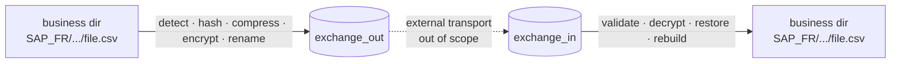

# FileRouter

[🇫🇷 Français](README.md) · **🇬🇧 English**

> **Local**, network-less file router for enterprise environments — detection,
> hashing, **compression**, OpenPGP encryption, audit and business-tree
> reconstruction, **with no database at all**.

[](docs/README.md)
[](docs/en/12-deployment.md)
[](#installation)
[](docs/en/18-testing-strategy.md)
[](LICENSE)

---

## What is FileRouter?

FileRouter detects files in **business directories** of unlimited depth, computes
their metadata and **SHA-256** digests, optionally compresses and encrypts/signs
them via **OpenPGP**, renames them to a configurable technical name, then moves them
through **flat** exchange directories (`exchange_out` / `exchange_in`). On the
receiving side it validates, decrypts, restores the original name and **rebuilds the
business tree**.

FileRouter performs **no network transport**: the actual transfer of files between
sites is handled by an external mechanism (MFT, replication, shared storage), out of
scope.



## Key principles

- 🗄️ **Zero database.** All state lives on the filesystem.
- 🌳 **Unlimited tree depth**, relative path computed dynamically.
- 🔗 **Alias-only transport**: only the business alias travels, paths stay local.
- 🗜️ **Optional gzip compression**, per rule (clear → compress → encrypt).
- 🔐 **OpenPGP**: encryption, signing, key management/rotation.
- 🧾 **Reconstructible per-file audit** + logs correlated by `technical_id`.
- ♻️ **Crash recovery**: atomic operations, idempotency — no loss, no double publish.
- 🖥️ **Cross-platform**: portable core, **Windows service (pywin32)** and Linux **systemd**.

---

## Installation

FileRouter runs **identically on Linux and Windows**. Common prerequisites:

- **Python 3.12+**
- **git** (to clone) or a project archive
- **GnuPG** *only if you enable encryption* (`encryption.backend: gnupg`) — see
  [Key generation](docs/en/06-encryption.md#8-key-generation--provisioning-linux--windows).
  Without encryption (`backend: noop`), GnuPG is not required.

> 💡 Everything runs in a dedicated Python **virtual environment**: no global system
> install, uninstall = delete the folder.

### 🐧 Linux — step by step

```bash
# 1. Install Python 3.12+ and GnuPG (GnuPG optional, only if encrypting)
sudo apt-get update && sudo apt-get install -y python3.12 python3.12-venv git gnupg
#   (RHEL/Rocky: sudo dnf install -y python3.12 git gnupg2)

# 2. Get the project
git clone <REPO_URL> filerouter && cd filerouter

# 3. Create and activate a virtual environment
python3.12 -m venv .venv
source .venv/bin/activate

# 4. Install FileRouter
pip install --upgrade pip
pip install .                 # base (noop backend, no encryption)
#   With GnuPG encryption:    pip install ".[gnupg]"

# 5. Create your configuration from the example
mkdir -p /etc/filerouter
cp docs/examples/config.example.yaml /etc/filerouter/config.yaml
#   → edit the paths (base_folders, exchange, runtime) for your server

# 6. Diagnose the environment BEFORE starting (anticipates every problem)
filerouter-doctor --config /etc/filerouter/config.yaml

# 7. Validate the configuration, then run in the foreground (Ctrl+C to stop)
filerouter --config /etc/filerouter/config.yaml validate-config
filerouter --config /etc/filerouter/config.yaml run
```

For a **systemd service** (auto-start, restart on failure), create
`/etc/systemd/system/filerouter.service` (full template in
[docs/en/12-deployment.md](docs/en/12-deployment.md#4-linux--systemd)):

```ini
[Unit]
Description=FileRouter
After=local-fs.target

[Service]
Type=simple
User=filerouter
Environment=FILEROUTER_CONFIG=/etc/filerouter/config.yaml
ExecStart=/opt/filerouter/.venv/bin/filerouter --config /etc/filerouter/config.yaml run
Restart=on-failure
RestartSec=5
NoNewPrivileges=true
ProtectSystem=strict
ReadWritePaths=/var/lib/filerouter /var/log/filerouter

[Install]
WantedBy=multi-user.target
```

```bash
sudo systemctl daemon-reload
sudo systemctl enable --now filerouter
sudo systemctl status filerouter
```

### 🪟 Windows — step by step (PowerShell)

```powershell
# 1. Install Python 3.12+ (check "Add python.exe to PATH" during setup)
#    and, IF encrypting, install Gpg4win: https://gpg4win.org

# 2. Get the project
git clone <REPO_URL> filerouter
cd filerouter

# 3. Create and activate a virtual environment
py -3.12 -m venv .venv
.\.venv\Scripts\Activate.ps1

# 4. Install FileRouter (+ Windows service support)
python -m pip install --upgrade pip
python -m pip install ".[windows]"
#   With GnuPG encryption:  python -m pip install ".[windows,gnupg]"

# 5. Create your configuration from the example
New-Item -ItemType Directory -Force -Path C:\ProgramData\FileRouter | Out-Null
Copy-Item docs\examples\config.example.yaml C:\ProgramData\FileRouter\config.yaml
#   → edit the paths (D:\..., E:\...) for your server

# 6. Diagnose, validate, then run in the foreground (Ctrl+C to stop)
filerouter-doctor --config C:\ProgramData\FileRouter\config.yaml
filerouter --config C:\ProgramData\FileRouter\config.yaml validate-config
filerouter --config C:\ProgramData\FileRouter\config.yaml run
```

For a **native Windows service** (managed by the Service Control Manager, no Task
Scheduler):

```powershell
# The service reads its config path from the FILEROUTER_CONFIG environment variable
setx FILEROUTER_CONFIG "C:\ProgramData\FileRouter\config.yaml" /M

# Install then start the service (run as administrator)
python -m filerouter.service.windows install
python -m filerouter.service.windows start

# Status / stop
sc query FileRouterService
python -m filerouter.service.windows stop
```

### ✅ Verify everything works

```bash
# Self-test (config + crypto backend), backlog and quarantine as JSON
filerouter --config <config_path> health

# Reconstruct a file's full history by its technical_id
filerouter --config <config_path> trace <technical_id>

# List quarantined items (should stay empty in normal operation)
filerouter --config <config_path> list-quarantine
```

### 🩺 Diagnostics & repair — `filerouter-doctor`

`filerouter-doctor` **anticipates problems** before production: it checks the
configuration (schema + consistency), the existence and **permissions** of the
directories (`base_folders`, `exchange`, `runtime`), that `runtime` and `exchange`
are on the **same volume**, the crypto backend and **key presence** (GnuPG
self-test, recipient/signing keys, authorized signers), and that
encryption/compression rules reference known aliases.

```bash
# Diagnose only: lists EVERY problem on standard output, with a clear,
# OS-aware solution for each problem it cannot fix on its own.
filerouter-doctor --config <config_path>

# Interactive repair: offers to fix safe problems (creating missing
# directories...) asking a question before each fix.
filerouter-doctor --config <config_path> --fix

# AUTOMATIC repair with no questions at all (unattended mode).
filerouter-doctor --config <config_path> --fix --yes
```

> Also available as a subcommand: `filerouter --config <…> doctor [--fix] [--yes]`.
> The doctor never "fixes" security-sensitive items (keys, permissions): it explains
> the exact command to run (`gpg --import`, `chmod`/`chown` on Linux, `icacls` on
> Windows).

> ℹ️ Technical directories (`runtime/staging`, `processing`, `audit`, `locks`, …) and
> the exchange directories are **created automatically** at startup if missing.
> `runtime/` and the exchange directories must live on the **same volume** (atomic
> publish). Details: [docs/en/03-state-management.md](docs/en/03-state-management.md).

### For developers (tests)

```bash
pip install ".[dev]"
pytest -q          # 106 tests (unit + e2e)
```

---

## Configuration at a glance

```yaml
base_folders:
  - alias: PAYMENT
    path: F:\payments         # the path varies per server, the alias stays stable

naming:
  pattern: "{flow}_{direction}_{timestamp}_{technical_id}.{extension}"

compression:
  algorithm: gzip             # compress before encryption (per rule)
  rules:
    - base_folder_alias: PAYMENT
      path_pattern: "**"
      enabled: true

encryption:
  backend: gnupg              # gnupg | pgpy | noop (noop = no encryption)
  rules:
    - base_folder_alias: PAYMENT
      path_pattern: "**"
      enabled: true
      recipient_key_ids: ["0xDEADBEEF"]
```

Full, commented configuration: [docs/examples/config.example.yaml](docs/examples/config.example.yaml)
· reference: [docs/en/05-configuration.md](docs/en/05-configuration.md).

## Documentation

The full specification is bilingual **🇫🇷 / 🇬🇧**:

- 🇫🇷 **French**: [`docs/fr/`](docs/fr/README.md)
- 🇬🇧 **English**: [`docs/en/`](docs/en/README.md)

Topics: architecture, flows, state management, data formats, configuration, OpenPGP
encryption, hashing, observability, error handling, security, archival, deployment,
operations, risk analysis, versioning, disaster recovery, project structure, testing
strategy.

## Status

**v1.0** application — working code + **106 passing tests** (unit + e2e: round trip,
real OpenPGP, compression, security/tamper, concurrency, recovery, IO failures,
doctor). The v1.0 CLI implements `validate-config`, `health`, `trace`,
`list-quarantine`, `reconcile`, `run`, `doctor`, plus the `filerouter-doctor` tool;
`status`, `replay`, `reload`, `keys list` are described as the target (see
[docs/en/13-operations-guide.md](docs/en/13-operations-guide.md)).

## License

See [LICENSE](LICENSE).
