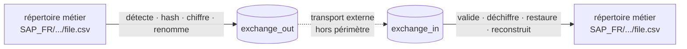

# FileRouter

**🇫🇷 Français** · [🇬🇧 English](README.en.md)

> Routeur de fichiers **local**, sans réseau, pour environnements d'entreprise —
> détection, hash, **compression**, chiffrement OpenPGP, audit et reconstruction
> d'arborescence métier, **sans aucune base de données**.

[](docs/README.md)
[](docs/fr/12-deployment.md)
[](#installation)
[](docs/fr/18-testing-strategy.md)
[](LICENSE)

---

## Qu'est-ce que FileRouter ?

FileRouter détecte des fichiers dans des **répertoires métier** de profondeur illimitée,
calcule leurs métadonnées et leurs empreintes **SHA-256**, les chiffre/signe éventuellement
via **OpenPGP**, les renomme avec un nom technique configurable, puis les déplace à travers
des répertoires d'échange **plats** (`exchange_out` / `exchange_in`). Côté réception, il
valide, déchiffre, restaure le nom d'origine et **reconstruit l'arborescence métier**.

FileRouter **ne fait aucun transport réseau** : le transfert effectif des fichiers entre
sites est assuré par un mécanisme externe (MFT, réplication, stockage partagé), hors
périmètre.



## Principes clés

- 🗄️ **Zéro base de données.** Tout l'état vit sur le système de fichiers.
- 🌳 **Arborescence illimitée**, chemin relatif calculé dynamiquement.
- 🔗 **Transport par alias** : seul l'alias métier voyage, les chemins restent locaux.
- 🗜️ **Compression** gzip optionnelle, configurable par règle (clair → compress → chiffre).
- 🔐 **OpenPGP** : chiffrement, signature, gestion/rotation de clés.
- 🧾 **Audit reconstructible** par fichier + logs corrélés par `technical_id`.
- ♻️ **Reprise sur incident** : opérations atomiques, idempotence — ni perte ni double publication.
- 🖥️ **Multi-plateforme** : cœur portable, **service Windows (pywin32)** et **systemd** Linux.

---

## Installation

FileRouter fonctionne **à l'identique sous Linux et Windows**. Prérequis communs :

- **Python 3.12+**
- **git** (pour cloner) ou une archive du projet
- **GnuPG** *uniquement si vous activez le chiffrement* (`encryption.backend: gnupg`) —
  voir [Génération des clés](docs/fr/06-encryption.md#8-génération--provisionnement-des-clés-linux--windows).
  Sans chiffrement (`backend: noop`), GnuPG n'est pas nécessaire.

> 💡 Tout passe par un **environnement virtuel Python** dédié : aucune installation
> système globale, désinstallation = suppression du dossier.

### 🐧 Linux — pas à pas

```bash
# 1. Installer Python 3.12+ et GnuPG (GnuPG optionnel, seulement si chiffrement)
sudo apt-get update && sudo apt-get install -y python3.12 python3.12-venv git gnupg
#   (RHEL/Rocky : sudo dnf install -y python3.12 git gnupg2)

# 2. Récupérer le projet
git clone <URL_DU_DEPOT> filerouter && cd filerouter

# 3. Créer et activer un environnement virtuel
python3.12 -m venv .venv
source .venv/bin/activate

# 4. Installer FileRouter
pip install --upgrade pip
pip install .                 # de base (backend noop, sans chiffrement)
#   Avec chiffrement GnuPG :  pip install ".[gnupg]"

# 5. Créer votre configuration à partir de l'exemple
mkdir -p /etc/filerouter
cp docs/examples/config.example.yaml /etc/filerouter/config.yaml
#   → éditez les chemins (base_folders, exchange, runtime) pour votre serveur

# 6. Vérifier la configuration AVANT de démarrer (échec explicite si invalide)
filerouter --config /etc/filerouter/config.yaml validate-config

# 7. Lancer au premier plan (Ctrl+C pour arrêter)
filerouter --config /etc/filerouter/config.yaml run
```

Pour un **service systemd** (démarrage automatique, redémarrage sur panne), créez
`/etc/systemd/system/filerouter.service` (modèle complet dans
[docs/fr/12-deployment.md](docs/fr/12-deployment.md#4-linux--systemd)) :

```ini
[Unit]
Description=FileRouter
After=local-fs.target

[Service]
Type=simple
User=filerouter
Environment=FILEROUTER_CONFIG=/etc/filerouter/config.yaml
ExecStart=/opt/filerouter/.venv/bin/filerouter --config /etc/filerouter/config.yaml run
Restart=on-failure
RestartSec=5
NoNewPrivileges=true
ProtectSystem=strict
ReadWritePaths=/var/lib/filerouter /var/log/filerouter

[Install]
WantedBy=multi-user.target
```

```bash
sudo systemctl daemon-reload
sudo systemctl enable --now filerouter
sudo systemctl status filerouter
```

### 🪟 Windows — pas à pas (PowerShell)

```powershell
# 1. Installer Python 3.12+ (cocher "Add python.exe to PATH" à l'installation)
#    et, SI chiffrement, installer Gpg4win : https://gpg4win.org

# 2. Récupérer le projet
git clone <URL_DU_DEPOT> filerouter
cd filerouter

# 3. Créer et activer un environnement virtuel
py -3.12 -m venv .venv
.\.venv\Scripts\Activate.ps1

# 4. Installer FileRouter (+ support service Windows)
python -m pip install --upgrade pip
python -m pip install ".[windows]"
#   Avec chiffrement GnuPG :  python -m pip install ".[windows,gnupg]"

# 5. Créer votre configuration à partir de l'exemple
New-Item -ItemType Directory -Force -Path C:\ProgramData\FileRouter | Out-Null
Copy-Item docs\examples\config.example.yaml C:\ProgramData\FileRouter\config.yaml
#   → éditez les chemins (D:\..., E:\...) pour votre serveur

# 6. Vérifier la configuration AVANT de démarrer
filerouter --config C:\ProgramData\FileRouter\config.yaml validate-config

# 7. Lancer au premier plan (Ctrl+C pour arrêter)
filerouter --config C:\ProgramData\FileRouter\config.yaml run
```

Pour un **service Windows natif** (géré par le gestionnaire de services, sans
Planificateur de tâches) :

```powershell
# Le service lit son chemin de config dans la variable d'environnement FILEROUTER_CONFIG
setx FILEROUTER_CONFIG "C:\ProgramData\FileRouter\config.yaml" /M

# Installer puis démarrer le service (à exécuter en administrateur)
python -m filerouter.service.windows install
python -m filerouter.service.windows start

# État / arrêt
sc query FileRouterService
python -m filerouter.service.windows stop
```

### ✅ Vérifier que tout fonctionne

```bash
# Self-test (config + backend crypto), backlog et quarantaine au format JSON
filerouter --config <chemin_config> health

# Suivre l'historique complet d'un fichier par son technical_id
filerouter --config <chemin_config> trace <technical_id>

# Lister les éléments en quarantaine (doit rester vide en fonctionnement normal)
filerouter --config <chemin_config> list-quarantine
```

### 🩺 Diagnostic & réparation — `filerouter-doctor`

`filerouter-doctor` **anticipe les problèmes** avant la mise en production : il vérifie
la configuration (schéma + cohérence), l'existence et les **droits** des répertoires
(`base_folders`, `exchange`, `runtime`), le fait que `runtime` et `exchange` soient sur
le **même volume**, le backend cryptographique et la **présence des clés** (auto-test
GnuPG, clés destinataire/signature, signataires autorisés), et que les règles de
chiffrement/compression référencent des alias connus.

```bash
# Diagnostic seul : liste TOUS les problèmes sur la sortie standard, avec, pour
# chaque problème non réparable, une solution claire adaptée à Linux/Windows.
filerouter-doctor --config <chemin_config>

# Réparation interactive : propose de corriger les problèmes sûrs (création de
# répertoires manquants…) en posant une question avant chaque correction.
filerouter-doctor --config <chemin_config> --fix

# Réparation AUTOMATIQUE sans aucune question (mode non interactif).
filerouter-doctor --config <chemin_config> --fix --yes
```

> Disponible aussi en sous-commande : `filerouter --config <…> doctor [--fix] [--yes]`.
> Le doctor ne « répare » jamais ce qui touche à la sécurité (clés, droits) : il
> explique précisément la commande à exécuter (`gpg --import`, `chmod`/`chown` sous
> Linux, `icacls` sous Windows).

> ℹ️ Les répertoires techniques (`runtime/staging`, `processing`, `audit`, `locks`, …) et
> les répertoires d'échange sont **créés automatiquement** au démarrage s'ils n'existent
> pas. `runtime/` et les répertoires d'échange doivent résider sur le **même volume**
> (publication atomique). Détails : [docs/fr/03-state-management.md](docs/fr/03-state-management.md).

### Pour les développeurs (tests)

```bash
pip install ".[dev]"
pytest -q          # 81 tests (unitaires + e2e)
```

---

## Configuration en bref

```yaml
base_folders:
  - alias: PAYMENT
    path: F:\payments         # le path varie par serveur, l'alias reste stable

naming:
  pattern: "{flow}_{direction}_{timestamp}_{technical_id}.{extension}"

compression:
  algorithm: gzip             # compresse avant chiffrement (par règle)
  rules:
    - base_folder_alias: PAYMENT
      path_pattern: "**"
      enabled: true

encryption:
  backend: gnupg              # gnupg | pgpy | noop (noop = pas de chiffrement)
  rules:
    - base_folder_alias: PAYMENT
      path_pattern: "**"
      enabled: true
      recipient_key_ids: ["0xDEADBEEF"]
```

Configuration complète et commentée : [docs/examples/config.example.yaml](docs/examples/config.example.yaml)
· référence : [docs/fr/05-configuration.md](docs/fr/05-configuration.md).

## Documentation

La spécification complète est bilingue **🇫🇷 / 🇬🇧** :

- 🇫🇷 **Français** : [`docs/fr/`](docs/fr/README.md)
- 🇬🇧 **English** : [`docs/en/`](docs/en/README.md)

Sujets : architecture, flux, gestion d'état, formats, configuration, chiffrement OpenPGP,
empreintes, observabilité, erreurs, sécurité, archivage, déploiement, exploitation, risques,
versionnement, reprise après incident, structure du projet, stratégie de tests.

## Statut

Application **v1.0** — code fonctionnel + **106 tests verts** (unitaires + e2e :
aller-retour, OpenPGP réel, compression, sécurité/falsification, concurrence, reprise,
échecs IO, doctor). La CLI v1.0 implémente `validate-config`, `health`, `trace`,
`list-quarantine`, `reconcile`, `run`, `doctor`, plus l'outil `filerouter-doctor` ;
`status`, `replay`, `reload`, `keys list` sont décrites comme cible (voir
[docs/fr/13-operations-guide.md](docs/fr/13-operations-guide.md)).

## Licence

Voir [LICENSE](LICENSE).
