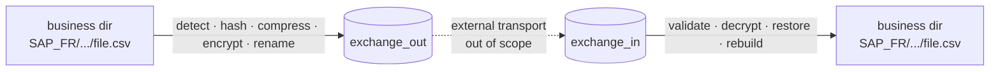

# FileRouter

**🇫🇷 [Français](#-français)** · **🇬🇧 [English](#-english)**

> 🇫🇷 Routeur de fichiers **local**, sans réseau, pour environnements d'entreprise —
> détection, hash, compression, chiffrement OpenPGP, audit et reconstruction
> d'arborescence métier, **sans aucune base de données**.
>
> 🇬🇧 **Local**, network-less file router for enterprise environments — detection,
> hashing, compression, OpenPGP encryption, audit and business-tree reconstruction,
> **with no database at all**.

[](docs/README.md)
[](docs/en/12-deployment.md)
[](#installation)
[](docs/en/18-testing-strategy.md)
[](LICENSE)



---

## 🇫🇷 Français

### Qu'est-ce que FileRouter ?

FileRouter détecte des fichiers dans des **répertoires métier** de profondeur illimitée,
calcule leurs métadonnées et leurs empreintes **SHA-256**, compresse et/ou chiffre/signe
éventuellement via **OpenPGP**, les renomme avec un nom technique configurable, puis les
déplace à travers des répertoires d'échange **plats** (`exchange_out` / `exchange_in`).
Côté réception, il valide, déchiffre, restaure le nom d'origine et **reconstruit
l'arborescence métier**.

FileRouter **ne fait aucun transport réseau** : le transfert entre sites est assuré par un
mécanisme externe (MFT, réplication, stockage partagé), hors périmètre.

### Principes clés

- 🗄️ **Zéro base de données.** Tout l'état vit sur le système de fichiers.
- 🌳 **Arborescence illimitée**, chemin relatif calculé dynamiquement.
- 🔗 **Transport par alias** : seul l'alias métier voyage, les chemins restent locaux.
- 🗜️ **Compression** gzip optionnelle, configurable par règle (clair → compresse → chiffre).
- 🔐 **OpenPGP** : chiffrement, signature, gestion/rotation de clés.
- 🧾 **Audit reconstructible** par fichier + logs corrélés par `technical_id`.
- ♻️ **Reprise sur incident** : opérations atomiques, idempotence — ni perte ni double publication.
- 🖥️ **Multi-plateforme** : cœur portable, **service Windows (pywin32)** et **systemd** Linux.

### Installation

FileRouter fonctionne **à l'identique sous Linux et Windows**. Prérequis communs :
**Python 3.12+**, **git**, et **GnuPG** *uniquement si vous activez le chiffrement*
(`backend: gnupg`). Tout passe par un **environnement virtuel** dédié.

#### 🐧 Linux

```bash
# 1. Python 3.12+ et GnuPG (GnuPG optionnel, seulement si chiffrement)
sudo apt-get update && sudo apt-get install -y python3.12 python3.12-venv git gnupg

# 2. Récupérer le projet, créer le venv, installer
git clone <URL_DU_DEPOT> filerouter && cd filerouter
python3.12 -m venv .venv && source .venv/bin/activate
pip install --upgrade pip
pip install .                 # de base ; chiffrement : pip install ".[gnupg]"

# 3. Config depuis l'exemple, diagnostic, validation, lancement
cp docs/examples/config.example.yaml /etc/filerouter/config.yaml   # éditez les chemins
filerouter-doctor --config /etc/filerouter/config.yaml --fix --yes # crée les répertoires
filerouter --config /etc/filerouter/config.yaml validate-config
filerouter --config /etc/filerouter/config.yaml run                # Ctrl+C pour arrêter
```

Service **systemd** : modèle complet dans
[docs/fr/12-deployment.md](docs/fr/12-deployment.md#4-linux--systemd).

#### 🪟 Windows (PowerShell)

```powershell
# 1. Installer Python 3.12+ ("Add python.exe to PATH") et, si chiffrement, Gpg4win.

# 2. Récupérer le projet, créer le venv, installer (+ support service Windows)
git clone <URL_DU_DEPOT> filerouter; cd filerouter
py -3.12 -m venv .venv; .\.venv\Scripts\Activate.ps1
python -m pip install --upgrade pip
python -m pip install ".[windows]"        # chiffrement : ".[windows,gnupg]"

# 3. Config depuis l'exemple, diagnostic, validation, lancement
Copy-Item docs\examples\config.example.yaml C:\ProgramData\FileRouter\config.yaml
filerouter-doctor --config C:\ProgramData\FileRouter\config.yaml --fix --yes
filerouter --config C:\ProgramData\FileRouter\config.yaml validate-config
filerouter --config C:\ProgramData\FileRouter\config.yaml run
```

Service **Windows natif** (sans Planificateur de tâches) :

```powershell
setx FILEROUTER_CONFIG "C:\ProgramData\FileRouter\config.yaml" /M
python -m filerouter.service.windows install
python -m filerouter.service.windows start
```

> Plusieurs instances sur une machine : `... install --instance siteA --config <…>`
> crée `FileRouter_siteA` (voir [docs/fr/12-deployment.md](docs/fr/12-deployment.md) et
> l'exemple 2-sites [`docs/examples/two-instance/`](docs/examples/two-instance/README.md)).

#### 🩺 Diagnostic & réparation — `filerouter-doctor`

`filerouter-doctor` **anticipe les problèmes** : config (schéma + cohérence), existence et
**droits** des répertoires, `runtime`/`exchange` sur le **même volume**, backend crypto et
**présence des clés**, alias des règles. Il **liste tous les problèmes** sur la sortie
standard avec, pour chacun, une **solution adaptée Linux/Windows**.

```bash
filerouter-doctor --config <chemin>            # diagnostic seul
filerouter-doctor --config <chemin> --fix      # réparation interactive (questions)
filerouter-doctor --config <chemin> --fix --yes  # réparation AUTOMATIQUE sans question
```

### Configuration en bref

```yaml
base_folders:
  - alias: PAYMENT
    path: F:\payments         # le path varie par serveur, l'alias reste stable
naming:
  pattern: "{flow}_{direction}_{timestamp}_{technical_id}.{extension}"
compression:
  algorithm: gzip             # compresse avant chiffrement (par règle)
  rules: [{ base_folder_alias: PAYMENT, path_pattern: "**", enabled: true }]
encryption:
  backend: gnupg              # gnupg | pgpy | noop (noop = pas de chiffrement)
  rules:
    - { base_folder_alias: PAYMENT, path_pattern: "**", enabled: true, recipient_key_ids: ["0xDEADBEEF"] }
```

Config complète et commentée : [docs/examples/config.example.yaml](docs/examples/config.example.yaml).

### Documentation

Spécification bilingue : 🇫🇷 [`docs/fr/`](docs/fr/README.md) · 🇬🇧 [`docs/en/`](docs/en/README.md).
Sujets : architecture, flux, gestion d'état, formats, configuration, chiffrement,
empreintes, observabilité, erreurs, sécurité, archivage, déploiement, exploitation,
risques, versionnement, reprise, structure, tests.

### Statut

Application **v1.0** — **116 tests verts** (unitaires + e2e : aller-retour, OpenPGP réel,
compression, sécurité/falsification, concurrence, reprise, échecs IO, doctor). CLI :
`validate-config`, `health`, `trace`, `list-quarantine`, `reconcile`, `run`, `doctor`,
plus `filerouter-doctor`.

### Licence

Voir [LICENSE](LICENSE).

---

## 🇬🇧 English

### What is FileRouter?

FileRouter detects files in **business directories** of unlimited depth, computes their
metadata and **SHA-256** digests, optionally compresses and encrypts/signs them via
**OpenPGP**, renames them to a configurable technical name, then moves them through
**flat** exchange directories (`exchange_out` / `exchange_in`). On the receiving side it
validates, decrypts, restores the original name and **rebuilds the business tree**.

FileRouter performs **no network transport**: the transfer between sites is handled by an
external mechanism (MFT, replication, shared storage), out of scope.

### Key principles

- 🗄️ **Zero database.** All state lives on the filesystem.
- 🌳 **Unlimited tree depth**, relative path computed dynamically.
- 🔗 **Alias-only transport**: only the business alias travels, paths stay local.
- 🗜️ **Optional gzip compression**, per rule (clear → compress → encrypt).
- 🔐 **OpenPGP**: encryption, signing, key management/rotation.
- 🧾 **Reconstructible per-file audit** + logs correlated by `technical_id`.
- ♻️ **Crash recovery**: atomic operations, idempotency — no loss, no double publish.
- 🖥️ **Cross-platform**: portable core, **Windows service (pywin32)** and Linux **systemd**.

### Installation

FileRouter runs **identically on Linux and Windows**. Common prerequisites: **Python
3.12+**, **git**, and **GnuPG** *only if you enable encryption* (`backend: gnupg`).
Everything runs in a dedicated **virtual environment**.

#### 🐧 Linux

```bash
# 1. Python 3.12+ and GnuPG (GnuPG optional, only if encrypting)
sudo apt-get update && sudo apt-get install -y python3.12 python3.12-venv git gnupg

# 2. Get the project, create the venv, install
git clone <REPO_URL> filerouter && cd filerouter
python3.12 -m venv .venv && source .venv/bin/activate
pip install --upgrade pip
pip install .                 # base ; encryption: pip install ".[gnupg]"

# 3. Config from the example, diagnose, validate, run
cp docs/examples/config.example.yaml /etc/filerouter/config.yaml   # edit the paths
filerouter-doctor --config /etc/filerouter/config.yaml --fix --yes # creates directories
filerouter --config /etc/filerouter/config.yaml validate-config
filerouter --config /etc/filerouter/config.yaml run                # Ctrl+C to stop
```

**systemd** service: full template in
[docs/en/12-deployment.md](docs/en/12-deployment.md#4-linux--systemd).

#### 🪟 Windows (PowerShell)

```powershell
# 1. Install Python 3.12+ ("Add python.exe to PATH") and, if encrypting, Gpg4win.

# 2. Get the project, create the venv, install (+ Windows service support)
git clone <REPO_URL> filerouter; cd filerouter
py -3.12 -m venv .venv; .\.venv\Scripts\Activate.ps1
python -m pip install --upgrade pip
python -m pip install ".[windows]"        # encryption: ".[windows,gnupg]"

# 3. Config from the example, diagnose, validate, run
Copy-Item docs\examples\config.example.yaml C:\ProgramData\FileRouter\config.yaml
filerouter-doctor --config C:\ProgramData\FileRouter\config.yaml --fix --yes
filerouter --config C:\ProgramData\FileRouter\config.yaml validate-config
filerouter --config C:\ProgramData\FileRouter\config.yaml run
```

Native **Windows service** (no Task Scheduler):

```powershell
setx FILEROUTER_CONFIG "C:\ProgramData\FileRouter\config.yaml" /M
python -m filerouter.service.windows install
python -m filerouter.service.windows start
```

> Multiple instances on one machine: `... install --instance siteA --config <…>` creates
> `FileRouter_siteA` (see [docs/en/12-deployment.md](docs/en/12-deployment.md) and the
> two-site example [`docs/examples/two-instance/`](docs/examples/two-instance/README.md)).

#### 🩺 Diagnostics & repair — `filerouter-doctor`

`filerouter-doctor` **anticipates problems**: config (schema + consistency), directory
existence and **permissions**, `runtime`/`exchange` on the **same volume**, crypto backend
and **key presence**, rule aliases. It **lists every problem** on standard output with, for
each, an **OS-aware solution** for Linux/Windows.

```bash
filerouter-doctor --config <path>            # diagnose only
filerouter-doctor --config <path> --fix      # interactive repair (questions)
filerouter-doctor --config <path> --fix --yes  # AUTOMATIC repair with no questions
```

### Configuration at a glance

```yaml
base_folders:
  - alias: PAYMENT
    path: F:\payments         # the path varies per server, the alias stays stable
naming:
  pattern: "{flow}_{direction}_{timestamp}_{technical_id}.{extension}"
compression:
  algorithm: gzip             # compress before encryption (per rule)
  rules: [{ base_folder_alias: PAYMENT, path_pattern: "**", enabled: true }]
encryption:
  backend: gnupg              # gnupg | pgpy | noop (noop = no encryption)
  rules:
    - { base_folder_alias: PAYMENT, path_pattern: "**", enabled: true, recipient_key_ids: ["0xDEADBEEF"] }
```

Full, commented config: [docs/examples/config.example.yaml](docs/examples/config.example.yaml).

### Documentation

Bilingual specification: 🇫🇷 [`docs/fr/`](docs/fr/README.md) · 🇬🇧 [`docs/en/`](docs/en/README.md).
Topics: architecture, flows, state management, data formats, configuration, encryption,
hashing, observability, error handling, security, archival, deployment, operations, risk
analysis, versioning, recovery, project structure, testing.

### Status

**v1.0** application — **116 passing tests** (unit + e2e: round trip, real OpenPGP,
compression, security/tamper, concurrency, recovery, IO failures, doctor). CLI:
`validate-config`, `health`, `trace`, `list-quarantine`, `reconcile`, `run`, `doctor`,
plus `filerouter-doctor`.

### License

See [LICENSE](LICENSE).
