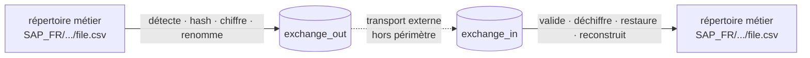

# FileRouter

> Routeur de fichiers **local**, sans réseau, pour environnements d'entreprise —
> détection, hash, chiffrement OpenPGP, audit et reconstruction d'arborescence métier,
> **sans aucune base de données**.

[](docs/README.md)
[](docs/12-deployment.md)
[](docs/12-deployment.md)
[](LICENSE)

---

## Qu'est-ce que FileRouter ?

FileRouter détecte des fichiers dans des **répertoires métier** de profondeur illimitée,
calcule leurs métadonnées et leurs empreintes **SHA-256**, les chiffre/signe éventuellement
via **OpenPGP**, les renomme avec un nom technique configurable, puis les déplace à travers
des répertoires d'échange **plats** (`exchange_out` / `exchange_in`). Côté réception, il
valide, déchiffre, restaure le nom d'origine et **reconstruit l'arborescence métier**.

FileRouter **ne fait aucun transport réseau** : le transfert effectif des fichiers entre
sites est assuré par un mécanisme externe (MFT, réplication, stockage partagé), hors
périmètre.



## Principes clés

- 🗄️ **Zéro base de données.** Tout l'état vit sur le système de fichiers : metadata, audit,
  verrous, répertoires techniques.
- 🌳 **Arborescence illimitée.** Aucune hypothèse de profondeur ; chemin relatif calculé
  dynamiquement.
- 🔗 **Transport par alias.** Seul l'alias métier voyage ; les chemins physiques restent
  locaux à chaque serveur.
- 🔐 **OpenPGP** chiffrement + signature, gestion et rotation de clés.
- 🧾 **Audit reconstructible** par fichier (JSON-Lines append-only) et **logs** corrélés par
  `technical_id`.
- ♻️ **Reprise sur incident** : opérations atomiques, idempotence, réconciliation — ni perte
  ni double publication.
- 🖥️ **Multi-plateforme** : cœur portable, **service Windows natif (pywin32)** et **systemd**
  Linux. Pas de Planificateur de tâches Windows.

## Statut

📐 **Spécification technique — v1.0.** Ce dépôt contient la **conception détaillée**
(architecture, formats, sécurité, exploitation, tests). L'implémentation Python n'est pas
encore livrée ; l'arborescence cible et la description des modules sont décrites dans la spec.

## Documentation

La spécification complète est dans [`docs/`](docs/README.md) :

| # | Document | Sujet |
|---|----------|-------|
| 00 | [Vue d'ensemble](docs/00-overview.md) | Contexte, périmètre, glossaire, principes |
| 01 | [Architecture](docs/01-architecture.md) | Hexagonale, ports & adaptateurs, diagrammes |
| 02 | [Flux](docs/02-flows.md) | Pipelines sortant/entrant, séquences |
| 03 | [Gestion d'état](docs/03-state-management.md) | `runtime/`, atomicité, verrouillage, reprise |
| 04 | [Formats de données](docs/04-data-formats.md) | Metadata, audit, nommage |
| 05 | [Configuration](docs/05-configuration.md) | Schéma YAML complet |
| 06 | [Chiffrement](docs/06-encryption.md) | OpenPGP, clés, rotation, signature |
| 07 | [Empreintes](docs/07-hashing.md) | SHA-256, ordre de validation |
| 08 | [Observabilité](docs/08-observability.md) | Logs, métriques, supervision |
| 09 | [Erreurs & doublons](docs/09-error-handling.md) | Taxonomie, retries, dédup |
| 10 | [Sécurité](docs/10-security-policy.md) | Modèle de menaces, durcissement |
| 11 | [Archivage & rétention](docs/11-archival-retention.md) | Politiques de purge |
| 12 | [Déploiement](docs/12-deployment.md) | Windows service, systemd |
| 13 | [Exploitation](docs/13-operations-guide.md) | Runbook, CLI |
| 14 | [Risques](docs/14-risk-analysis.md) | Registre des risques |
| 15 | [Versionnement](docs/15-versioning-upgrade.md) | Upgrade, migration |
| 16 | [Reprise](docs/16-disaster-recovery.md) | Disaster recovery |
| 17 | [Structure projet](docs/17-project-structure.md) | Arborescence Python, modules |
| 18 | [Tests](docs/18-testing-strategy.md) | Toutes catégories de tests |

**Artefacts vérifiables** : schémas JSON ([metadata](docs/schemas/metadata.schema.json),
[audit](docs/schemas/audit.schema.json), [config](docs/schemas/config.schema.json)) et
exemples de référence ([config](docs/examples/config.example.yaml),
[metadata](docs/examples/PAYMENT_OUT_20260608T120000_ABC123.meta.json),
[audit](docs/examples/ABC123.audit.json)).

## Aperçu de la configuration

```yaml
base_folders:
  - alias: PAYMENT
    path: F:\payments         # le path varie par serveur, l'alias reste stable

naming:
  pattern: "{flow}_{direction}_{timestamp}_{technical_id}.{extension}"

encryption:
  backend: gnupg
  rules:
    - base_folder_alias: PAYMENT
      path_pattern: "**"
      enabled: true
      recipient_key_ids: ["0xDEADBEEF"]
```

Configuration complète : [`docs/examples/config.example.yaml`](docs/examples/config.example.yaml).

## Plateformes cibles

- **Windows Server 2019+** — service natif via pywin32.
- **Linux** — systemd (`Type=notify`).
- **Python 3.12+**.

## Licence

Voir [LICENSE](LICENSE).
