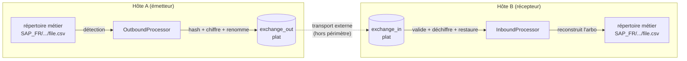

# 00 — Vue d'ensemble

## 1. Objet

FileRouter est un **routeur de fichiers local**. Il n'effectue **aucun transport réseau**.
Le transfert réel des fichiers entre sites est assuré par un mécanisme externe hors
périmètre (MFT, réplication, stockage partagé, etc.). FileRouter interagit uniquement avec
le **système de fichiers local** :

- des **répertoires métier** (`base_folders`) — les arborescences source/destination, de
  profondeur arbitraire ;
- un répertoire d'échange sortant plat (`exchange_out`) ;
- un répertoire d'échange entrant plat (`exchange_in`).

## 2. Responsabilités

FileRouter est responsable de :

1. **Détecter** les fichiers apparaissant dans les répertoires métier (sortant) ou dans
   `exchange_in` (entrant).
2. **Calculer les métadonnées** (alias d'origine, chemin relatif, nom d'origine,
   horodatages).
3. **Calculer les empreintes SHA-256** du fichier clair et du payload chiffré.
4. **Chiffrer/déchiffrer** les fichiers selon des règles configurables (OpenPGP), y compris
   la **signature** et la **vérification de signature**.
5. **Renommer** les fichiers avec un nom technique configurable, lisible pour le support.
6. **Déplacer** les fichiers entre les arborescences métier et les répertoires d'échange
   plats.
7. **Reconstruire** l'arborescence métier côté réception à partir des métadonnées
   transportées.
8. **Produire des fichiers d'audit** permettant de reconstituer intégralement l'historique
   de chaque fichier.
9. **Produire des logs d'exploitation** pour le support, la sécurité et l'administration.

## 3. Limites du périmètre (non-objectifs)

| Dans le périmètre | Hors périmètre |
|-------------------|----------------|
| Détection, hash, crypto, renommage, déplacement locaux | Transport réseau des fichiers |
| État et audit sur système de fichiers | Toute base de données (SQLite, SQL, distante) |
| Cœur multi-plateforme (Linux + Windows) | IHM / front interactif |
| Service Windows natif + systemd Linux | Planificateur de tâches Windows (exclu) |
| Chiffrement/signature OpenPGP | Cryptographie maison |

## 4. Contraintes fortes

- **Aucune base de données.** État, audit et verrouillage uniquement sur système de
  fichiers.
- **`base_folders` illimités.** Nombre quelconque de racines métier, déclarées par alias.
- **Profondeur d'arborescence illimitée.** Aucune hypothèse sur l'imbrication ; les chemins
  relatifs sont calculés dynamiquement.
- **Répertoires d'échange plats.** `exchange_in` / `exchange_out` ne contiennent jamais de
  sous-répertoire.
- **Transport par alias uniquement.** Seul l'*alias* métier voyage avec le fichier ; les
  chemins physiques sont locaux à chaque hôte et peuvent différer d'un serveur à l'autre.
- **SHA-256** est l'algorithme de hash imposé.
- **Aucun paramètre métier en dur.** Tout ce qui est configurable réside dans le YAML.

## 5. Concepts clés & glossaire

| Terme | Définition |
|-------|------------|
| **base_folder** | Racine métier déclarée, identifiée par un `alias` stable et un `path` local à l'hôte. Chaque fichier appartient à exactement un base_folder. |
| **alias** | Identifiant logique indépendant de l'hôte d'un base_folder (ex. `SAP_FR`). Seule clé de routage transportée entre hôtes. |
| **relative_path** | Chemin d'un fichier relatif à la racine de son base_folder, normalisé POSIX, de profondeur illimitée. |
| **exchange_out / exchange_in** | Répertoires d'échange plats à la frontière avec le transport externe. |
| **technical_id** | Identifiant unique global (ULID/UUIDv4) attribué à un fichier dès la détection ; clé de corrélation principale entre metadata, audit et logs. |
| **nom technique** | Nom de fichier configurable, plat, lisible par le support, utilisé dans les répertoires d'échange. |
| **metadata** | Fichier JSON décrivant un fichier routé (alias, chemin relatif, empreintes, état crypto, …). |
| **payload** | Le contenu transporté (chiffré si une règle s'applique, sinon le fichier clair). |
| **fichier d'audit** | Historique JSON-Lines, par fichier, en ajout seul, des événements modifiant l'état. |
| **runtime/** | Arborescence technique d'état détenue par FileRouter. |
| **CryptoProvider** | Port abstrayant le backend OpenPGP (GnuPG via `python-gnupg`, ou PGPy). |

## 6. Principes de conception

1. **Le système de fichiers est la base de données.** Tout fait durable est un fichier ;
   toute transition est un renommage atomique. C'est la contrainte structurante majeure.
2. **Idempotence.** Chaque étape de pipeline peut être ré-exécutée sans risque après un
   crash ; retraiter le même fichier produit le même résultat (clé : `technical_id` +
   `clear_file_hash`).
3. **Atomicité plutôt que verrouillage.** Préférer `os.replace` atomique à un état mutable
   partagé ; les verrous sont consultatifs et auto-réparants (TTL + heartbeat).
4. **Portabilité par isolation.** Le cœur est du Python pur au-dessus d'un petit ensemble
   de ports ; les comportements spécifiques OS/crypto/horloge vivent dans des adaptateurs
   (architecture hexagonale).
5. **Observabilité par défaut.** Chaque étape émet un événement d'audit corrélé et une
   ligne de log structurée, indexés par `technical_id`.
6. **Échec sûr, jamais de perte de fichier.** Au moindre doute, un fichier est mis en
   quarantaine dans `error/` avec son contexte, jamais supprimé ni perdu silencieusement.
7. **La configuration est un contrat.** Le comportement est piloté par le YAML, validé par
   schéma au démarrage ; le binaire n'embarque aucune règle métier.

## 7. Flux de haut niveau

Voir [01 — Architecture](01-architecture.md) pour le découpage interne et
[02 — Flux](02-flows.md) pour les diagrammes de séquence détaillés.
