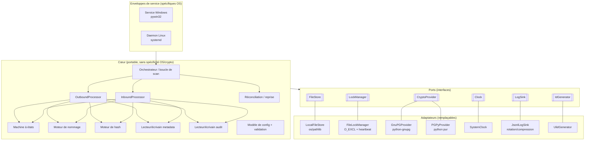

# 01 — Architecture

## 1. Style architectural

FileRouter adopte une architecture **hexagonale (ports & adaptateurs)** avec un cœur
strictement portable. C'est ce qui permet au même moteur de fonctionner à l'identique sur
Windows Server et Linux, et d'être testé unitairement de façon exhaustive sans toucher à un
vrai système de fichiers ni à un vrai trousseau de clés.

### Justification
- Le **cœur ne dépend que des ports** (interfaces Python `Protocol`/ABC). Il n'importe
  jamais directement `os`, `gnupg`, `win32service`, etc.
- Les **adaptateurs** implémentent les ports avec une technologie concrète. Remplacer GnuPG
  par PGPy, ou une vraie horloge par une horloge de test figée, est un simple changement de
  câblage.
- Les **enveloppes de service** sont le seul code spécifique à l'OS et ne contiennent
  *aucune logique métier* — elles démarrent/arrêtent la boucle de l'orchestrateur et
  traduisent les signaux de cycle de vie de l'OS.

## 2. Composants

### 2.1 Orchestrateur (boucle de scan)
Le daemon portable. À chaque tick (`scan_interval` configurable) il :
1. exécute la **réconciliation au démarrage** une fois au boot (voir [03](03-state-management.md)) ;
2. énumère les répertoires métier pour le travail sortant et `exchange_in` pour le travail
   entrant, en appliquant les règles d'inclusion/exclusion ;
3. distribue les fichiers éligibles au pool de workers ;
4. honore un drapeau d'arrêt coopératif pour un arrêt de service propre.

Concurrence : un pool de workers borné (threads ou processus, configurable). La coordination
entre workers passe **uniquement par les verrous fichier** — aucun état partagé en mémoire,
donc la même conception fonctionne entre plusieurs processus, voire plusieurs hôtes
partageant le stockage.

### 2.2 OutboundProcessor
Implémente le pipeline sortant en 10 étapes (détecter → identifier base_folder → chemin
relatif → règles → hash → chiffrer → metadata → nom technique → déplacer vers `exchange_out`
→ audit → archiver/supprimer la source). Chaque étape est idempotente et émet un événement
d'audit. Voir [02 — Flux](02-flows.md).

### 2.3 InboundProcessor
Implémente le pipeline entrant en 8 étapes (charger metadata → vérifier hash payload →
déchiffrer → résoudre le base_folder cible → recalculer le chemin métier → restaurer le nom
d'origine → déplacer vers le répertoire métier → audit). L'ordre de vérification est strict ;
voir [07 — Empreintes](07-hashing.md).

### 2.4 Machine à états
Détient les transitions légales entre les états `runtime/` et les opérations **atomiques**
qui les réalisent. Autorité unique sur « quel déplacement est permis ensuite ».

### 2.5 Moteur de nommage
Génère le nom technique configurable à partir d'un motif à placeholders, applique la
longueur maximale, garantit un `technical_id` unique, et fournit le **mapping inverse**
utilisé en entrant pour restaurer le nom d'origine depuis la metadata. Voir
[04 — Formats de données](04-data-formats.md).

### 2.6 Moteur de hash
Calcule SHA-256 en flux sur les gros fichiers (mémoire constante). Calcule le **hash clair**
avant chiffrement et le **hash payload** après. Voir [07](07-hashing.md).

### 2.7 Écrivains metadata & audit
Sérialisent/valident la metadata et ajoutent les événements d'audit. Tous deux écrivent dans
`temp/` puis **renomment atomiquement** en place, de sorte qu'un lecteur ne voit jamais un
fichier partiel.

### 2.8 Réconciliation / reprise
Au démarrage et périodiquement, scanne `staging/`, `processing/`, `temp/` et `locks/` pour
détecter les orphelins, les verrous périmés et les transitions interrompues, puis les
relance ou les met en quarantaine. Voir [16 — Reprise après incident](16-disaster-recovery.md).

### 2.9 Modèle de config
Charge le YAML, le valide via [`config.schema.json`](schemas/config.schema.json), résout les
chemins `base_folders` locaux à l'hôte, compile les règles d'inclusion/exclusion et de
chiffrement. Une config invalide interrompt le démarrage (fail-fast).

## 3. Ports (interfaces)

| Port | Responsabilité | Adaptateur par défaut |
|------|----------------|-----------------------|
| `FileStore` | Déplacement/copie/renommage atomiques, fsync, stat, énumération, contrôle de taille stable | `LocalFileStore` (os/pathlib) |
| `LockManager` | Acquérir/libérer des verrous consultatifs, heartbeat, détection de périmé | `FileLockManager` (`O_EXCL`) |
| `CryptoProvider` | Chiffrer, déchiffrer, signer, vérifier, recherche/rotation de clés | `GnuPGProvider` / `PGPyProvider` |
| `Clock` | Temps monotone + horloge murale, formatage d'horodatage | `SystemClock` |
| `LogSink` | Émission JSON-Lines structurée, rotation/compression | `JsonlLogSink` |
| `IdGenerator` | `technical_id` unique | `UlidGenerator` |

## 4. Propriété des données

| Donnée | Propriétaire | Format | Emplacement |
|--------|--------------|--------|-------------|
| Contenu du fichier routé | FileStore | binaire | arbre métier / échange / runtime |
| Metadata | Écrivain metadata | JSON | à côté du payload + `runtime/processing` |
| Audit | Écrivain audit | JSON-Lines | `runtime/audit/<technical_id>.audit.json` |
| Verrous | LockManager | JSON | `runtime/locks/<key>.lock` |
| Logs | LogSink | JSON-Lines | `logs/<stream>/…` |
| Config | Modèle de config | YAML | externe, lecture seule à l'exécution |

## 5. Modèle de concurrence & cohérence

- **Un seul écrivain par fichier**, garanti par un verrou nommé d'après le `technical_id`
  (ou, avant l'attribution d'un id, d'après un hash stable du chemin source absolu).
- **Publication atomique** : tout artefact visible de l'extérieur (payload, metadata, audit)
  est produit dans `temp/` puis rendu visible par un unique renommage atomique.
- **Aucune lecture partielle** : les consommateurs ne voient jamais que des fichiers
  entièrement écrits, grâce à la discipline temp-puis-renommage.
- **Cohérence au crash** : chaque transition étant un renommage atomique, tout crash laisse
  le système dans l'un des états finis et récupérables compris par l'étape de réconciliation.

## 6. Considérations multi-plateforme

- Tous les chemins via `pathlib.PurePath`/`Path` ; les chemins relatifs sont stockés
  normalisés POSIX dans la metadata afin de transiter entre hôtes Windows et Linux.
- Renommage atomique : `os.replace` (atomique sur NTFS et POSIX **au sein d'un volume**) ;
  le cross-volume est géré par copie-vers-temp + fsync + renommage (voir [03](03-state-management.md)).
- Portabilité des noms : noms techniques restreints à un jeu de caractères portable ;
  sensibilité à la casse et noms Windows réservés pris en compte par le moteur de nommage.
- Aucune dépendance à des sémantiques POSIX uniquement (ex. suppression de fichier ouvert) ;
  les particularités de verrouillage Windows sont gérées par les contrôles de taille
  stable/retry du `FileStore`.
