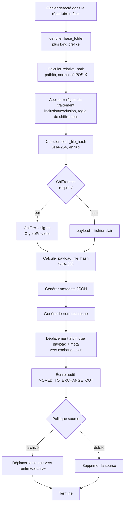
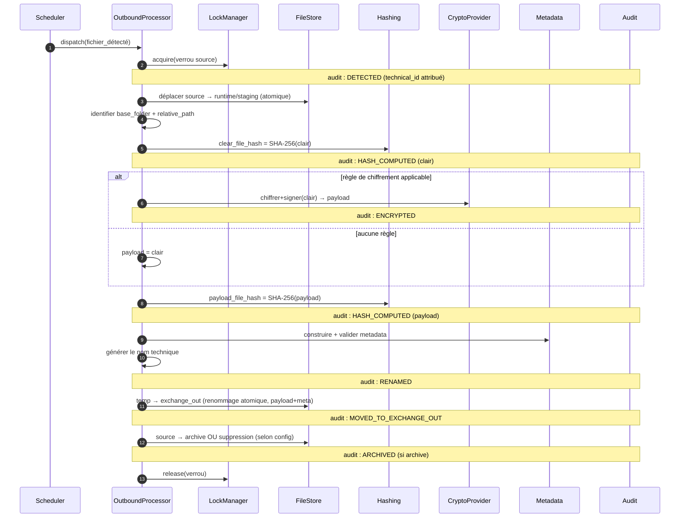
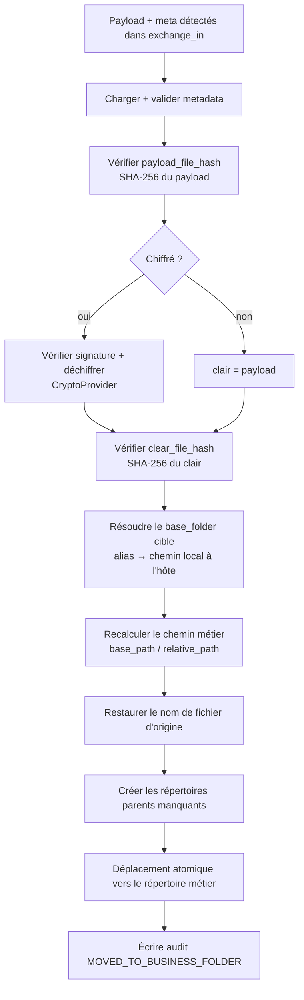
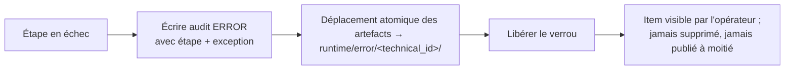

# 02 — Flux

Ce document spécifie les pipelines **sortant** et **entrant** sous forme de diagrammes de
flux et de séquence. Chaque étape est annotée avec l'événement d'audit qu'elle émet (voir
[04 — Formats de données](04-data-formats.md)) et le répertoire `runtime/` qu'occupe le
fichier (voir [03 — Gestion d'état](03-state-management.md)).

## 1. Pipeline sortant (métier → exchange_out)



### Diagramme de séquence sortant



### Correspondance étape ↔ audit ↔ état (sortant)

| # | Étape | Événement d'audit | État runtime |
|---|-------|-------------------|--------------|
| 1 | Détecter, attribuer `technical_id` | `DETECTED` | `staging/` |
| 2 | Identifier base_folder | — | `staging/` |
| 3 | Calculer relative_path | — | `staging/` |
| 4 | Appliquer les règles | — | `processing/` |
| 5 | Hash clair | `HASH_COMPUTED` | `processing/` |
| 6 | Chiffrer+signer (si règle) | `ENCRYPTED` | `processing/` |
| 7 | Hash payload | `HASH_COMPUTED` | `processing/` |
| 8 | Construire metadata | — | `processing/` |
| 9 | Nom technique | `RENAMED` | `processing/` → `temp/` |
| 10 | Déplacer vers exchange_out | `MOVED_TO_EXCHANGE_OUT` | `exchange_out/` |
| 11 | Archiver/supprimer source | `ARCHIVED` / — | `archive/` ou supprimé |

## 2. Pipeline entrant (exchange_in → métier)



### Diagramme de séquence entrant

```mermaid
sequenceDiagram
    autonumber
    participant SC as Scheduler
    participant IP as InboundProcessor
    participant LK as LockManager
    participant MD as Metadata
    participant HS as Hashing
    participant CR as CryptoProvider
    participant FS as FileStore
    participant AU as Audit

    SC->>IP: dispatch(paire exchange_in)
    IP->>LK: acquire(verrou technical_id)
    IP->>MD: charger + valider (schéma) la metadata
    Note over IP,AU: audit : RECEIVED_FROM_EXCHANGE_IN
    IP->>FS: déplacer la paire → runtime/processing (atomique)
    IP->>HS: vérifier SHA-256(payload) == payload_file_hash
    Note over IP,AU: audit : HASH_VALIDATED (payload)
    alt encrypted == true
        IP->>CR: vérifier signature + déchiffrer → clair
        Note over IP,AU: audit : DECRYPTED
    else
        IP->>IP: clair = payload
    end
    IP->>HS: vérifier SHA-256(clair) == clear_file_hash
    Note over IP,AU: audit : HASH_VALIDATED (clair)
    IP->>IP: résoudre alias → chemin base_folder
    IP->>IP: business_path = base_path / relative_path
    IP->>IP: filename = original_filename
    Note over IP,AU: audit : RESTORED
    IP->>FS: mkdir -p parents ; temp → métier (atomique)
    Note over IP,AU: audit : MOVED_TO_BUSINESS_FOLDER
    IP->>LK: release(verrou)
```

### Correspondance étape ↔ audit ↔ état (entrant)

| # | Étape | Événement d'audit | État runtime |
|---|-------|-------------------|--------------|
| 1 | Détecter la paire, verrouiller | `RECEIVED_FROM_EXCHANGE_IN` | `exchange_in/` → `processing/` |
| 2 | Charger+valider metadata | — | `processing/` |
| 3 | Vérifier hash payload | `HASH_VALIDATED` | `processing/` |
| 4 | Vérifier sig + déchiffrer | `DECRYPTED` | `processing/` |
| 5 | Vérifier hash clair | `HASH_VALIDATED` | `processing/` |
| 6 | Résoudre base_folder | — | `processing/` |
| 7 | Recalculer chemin + restaurer nom | `RESTORED` | `processing/` → `temp/` |
| 8 | Déplacer vers le répertoire métier | `MOVED_TO_BUSINESS_FOLDER` | arbre métier |

## 3. Chemin d'erreur (les deux pipelines)

Toute défaillance non rattrapée à n'importe quelle étape :



Les items en quarantaine ne sont **jamais** supprimés automatiquement. La reprise et le
rejeu sont traités dans [09 — Gestion des erreurs](09-error-handling.md) et
[16 — Reprise après incident](16-disaster-recovery.md).
