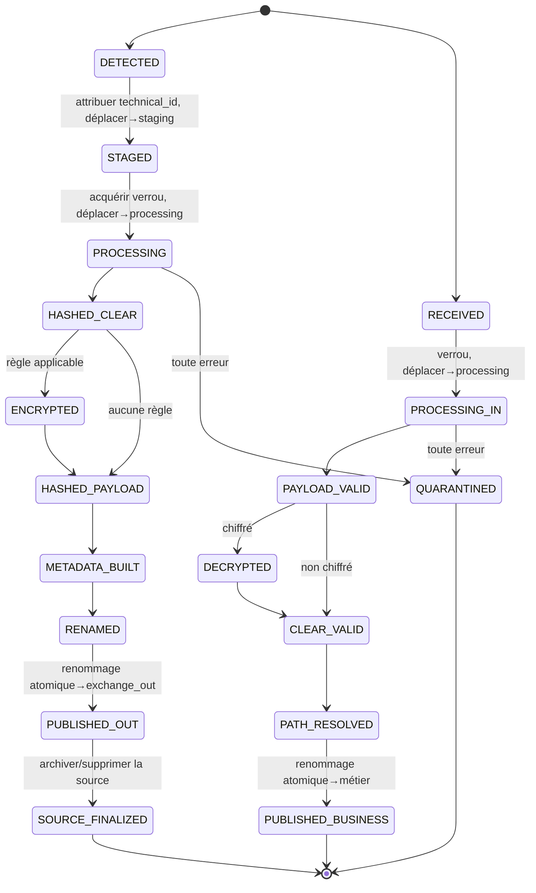
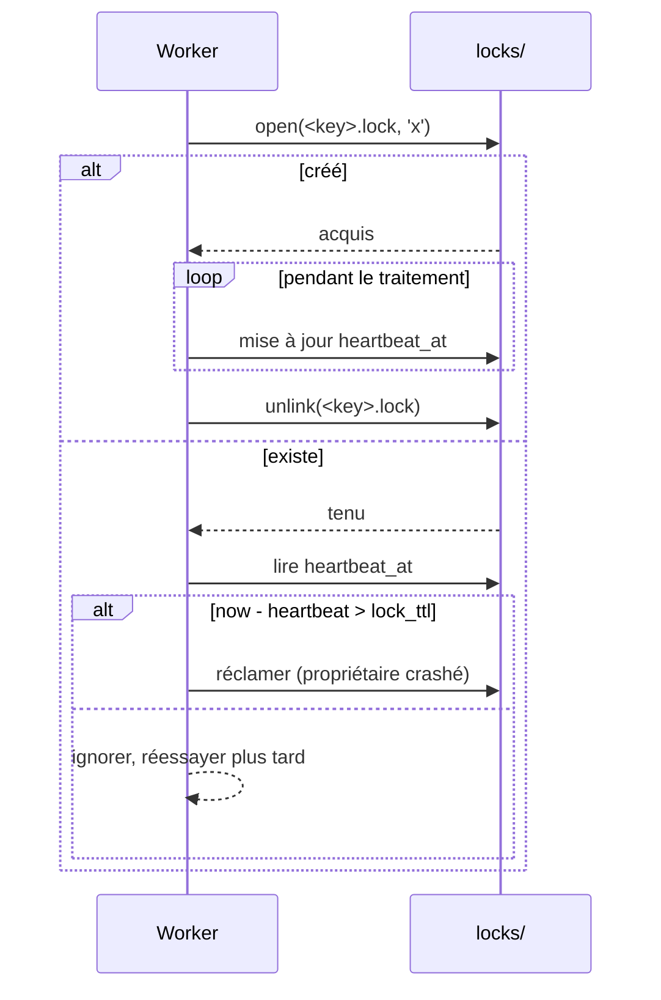

# 03 — Gestion d'état

Tout l'état est conservé sur le système de fichiers. Il n'y a **aucune base de données**. Ce
document définit la disposition des répertoires techniques, la machine à états par fichier,
les opérations atomiques qui réalisent les transitions, le protocole de verrouillage et la
sémantique de reprise après crash.

## 1. L'arborescence `runtime/`

```text
runtime/
├── staging/      # items fraîchement détectés, technical_id attribué, pas encore traités
├── processing/   # items en cours de traitement dans un pipeline
├── archive/      # fichiers sources conservés après un sortant réussi (selon config)
├── error/        # items en quarantaine + leur contexte (un sous-rép. par technical_id)
├── audit/        # logs d'audit par fichier, en ajout seul (<technical_id>.audit.json)
├── locks/        # fichiers de verrou consultatifs (<key>.lock)
└── temp/         # zone scratch pour les écritures en cours avant publication atomique
```

> `runtime/` DOIT résider sur le **même volume** que les répertoires d'échange afin que les
> opérations de publication soient des renommages atomiques intra-volume. Si les répertoires
> métier sont sur d'autres volumes, les copies cross-volume sont gérées explicitement
> (voir §4.2).

| Répertoire | Rôle | Durée de vie | Nettoyé par |
|------------|------|--------------|-------------|
| `staging/` | Contient les items détectés entre la détection et le début du traitement. Découple la détection du débit de traitement. | Courte | Réconciliation (relance) |
| `processing/` | Le working set ; exactement les fichiers qu'un worker possède actuellement (verrou tenu). | Courte | Réconciliation (relance des items périmés) |
| `archive/` | Sources sortantes conservées pour traçabilité/retraitement. | Selon rétention | Balayage de rétention ([11](11-archival-retention.md)) |
| `error/` | Quarantaine. Un sous-répertoire par `technical_id` en échec, contenant payload, snapshot metadata et un `error.json`. | Jusqu'à action opérateur | Opérateur / outil de rejeu |
| `audit/` | Historique durable par fichier. | Selon rétention | Balayage de rétention |
| `locks/` | Verrous consultatifs avec heartbeat. | Liée au traitement | Reaper de verrous périmés |
| `temp/` | Scratch pour écritures partielles ; rien ici n'est jamais visible de l'extérieur. | Très courte | Réconciliation (purge des orphelins) |

## 2. Machine à états par fichier



L'état courant d'un fichier est **implicite dans son emplacement** plus sa piste d'audit. Il
n'y a aucun champ d'état séparé à maintenir synchronisé — le répertoire *est* l'état. C'est
ce qui rend la reprise après crash déterministe.

## 3. Table de transitions (extrait)

| Depuis (emplacement) | Déclencheur | Op. atomique | Vers (emplacement) | Audit |
|----------------------|-------------|--------------|--------------------|-------|
| répertoire métier | détection | `os.replace` | `staging/<id>__<orig>` | `DETECTED` |
| `staging/` | verrou acquis | `os.replace` | `processing/<id>/` | — |
| `processing/` | metadata+nom prêts | écrire dans `temp/`, `os.replace` | `exchange_out/<techname>` | `MOVED_TO_EXCHANGE_OUT` |
| `processing/` | succès | `os.replace`/`unlink` | `archive/` ou supprimé | `ARCHIVED` |
| `exchange_in/` | détection | `os.replace` | `processing/<id>/` | `RECEIVED_FROM_EXCHANGE_IN` |
| `processing/` | validé+restauré | `os.replace` | répertoire métier | `MOVED_TO_BUSINESS_FOLDER` |
| `processing/` | erreur | `os.replace` | `error/<id>/` | `ERROR` |

## 4. Opérations atomiques

### 4.1 Intra-volume (cas courant)
- **`os.replace(src, dst)`** est atomique sur NTFS et POSIX. Utilisé pour chaque publication
  et chaque déplacement d'état au sein du volume runtime/échange.
- **Écrire-puis-renommer** : payload, metadata et audit sont d'abord écrits dans `temp/`,
  `fsync`és, puis `os.replace`és vers leur nom final. Un lecteur n'observe donc jamais un
  fichier partiel.

### 4.2 Cross-volume (répertoire métier sur un autre disque)
`os.replace` n'est pas atomique entre volumes. L'adaptateur `FileStore` réalise :
1. copie `src` → `dst.partial` sur le volume de destination ;
2. `fsync` du fichier destination et de son répertoire ;
3. `os.replace(dst.partial, dst)` (intra-volume, atomique) ;
4. vérification taille/hash, puis suppression de `src`.
Un crash avant l'étape 3 ne laisse qu'un fichier `*.partial`, purgé par la réconciliation.

### 4.3 Durabilité des répertoires
Après création des sous-répertoires métier en entrant, le répertoire parent est `fsync`é (là
où la plateforme le permet) afin que l'arborescence survive à une coupure de courant.

## 5. Protocole de verrouillage

- **Fichier de verrou** : `runtime/locks/<key>.lock`, créé avec `O_EXCL` (`open(..., 'x')`)
  — un test-and-set atomique. Succès de la création = verrou acquis ; `FileExistsError` =
  tenu ailleurs.
- **Clé** : `technical_id` une fois attribué ; avant cela, un hash stable du chemin source
  absolu (afin que la même source ne soit pas prise deux fois en parallèle).
- **Contenu** (JSON) : `{host, pid, technical_id, acquired_at, heartbeat_at, stage}`.
- **Heartbeat** : le worker propriétaire réécrit `heartbeat_at` tous les
  `heartbeat_interval`.
- **Détection de périmé** : un verrou dont `heartbeat_at` est plus ancien que `lock_ttl`
  (≫ intervalle de heartbeat) est considéré abandonné (crash du propriétaire). Le reaper
  vérifie que le propriétaire est réellement disparu (contrôle PID/hôte si possible) avant de
  le réclamer.
- **Libération** : suppression du fichier de verrou (best-effort ; un verrou périmé résiduel
  est auto-réparant via le TTL).



## 6. Sémantique de reprise (réconciliation au démarrage)

Exécutée une fois au boot puis périodiquement :

1. **`temp/`** — tout ce qui s'y trouve est une écriture partielle interrompue sans
   consommateur → suppression.
2. **`processing/<id>/`** — pipeline interrompu. Si le verrou est périmé/absent, relancer
   depuis le dernier événement d'audit (les étapes idempotentes rendent cela sûr). Si le
   déplacement vers la destination finale a déjà eu lieu (vérifié par présence + hash),
   finaliser simplement et nettoyer.
3. **`staging/`** — items jamais démarrés → ré-enfiler.
4. **`locks/`** — supprimer les verrous au-delà de `lock_ttl` après contrôle de vivacité du
   propriétaire.
5. **`exchange_out` / `exchange_in`** — un payload sans son `.meta.json` (ou l'inverse) est
   une paire incomplète ; attendre `pair_grace_period`, puis mettre en quarantaine si
   toujours incomplète.
6. **Doublons** — si un `technical_id` possède déjà un événement d'audit terminal, la copie
   re-détectée est un doublon (voir [09 — Gestion des erreurs](09-error-handling.md)).

Chaque transition étant un unique renommage atomique et chaque étape étant idempotente,
**tout** point de crash correspond à exactement l'un des cas ci-dessus. Aucun état n'est
jamais ambigu. La reprise complète après incident est détaillée dans
[16 — Reprise après incident](16-disaster-recovery.md).

## 7. Détection de stabilité de fichier

Un fichier encore en cours d'écriture par un producteur ne doit pas être pris en charge.
Avant détection, `FileStore` applique un **contrôle de taille stable** : la taille et le
mtime du fichier doivent rester inchangés sur `stability_checks` sondages consécutifs
espacés de `stability_interval`. Sous Windows, une sonde d'ouverture exclusive
supplémentaire détecte les fichiers encore verrouillés par l'écrivain.
