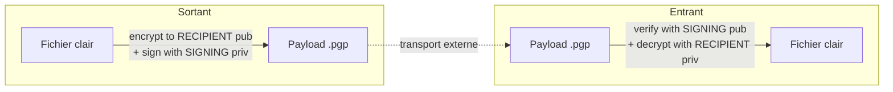
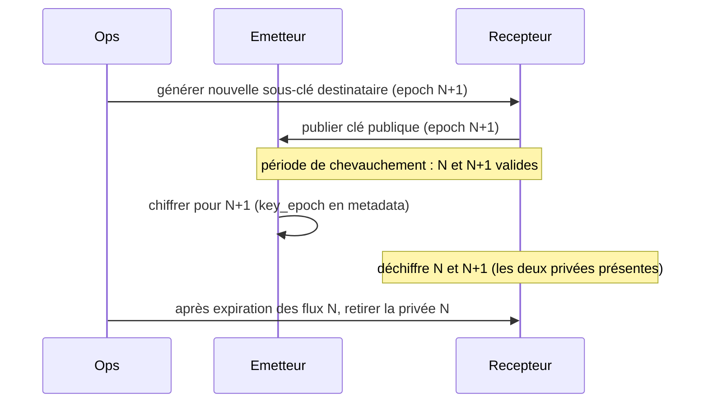

# 06 — Chiffrement (OpenPGP)

Le chiffrement est **configurable par règle** (voir [05 §2.7](05-configuration.md)). FileRouter
chiffre **et signe** avant le déplacement vers `exchange_out`, et **vérifie la signature puis
déchiffre** avant l'intégration entrante. L'implémentation passe par le port abstrait
`CryptoProvider`, ce qui rend le backend interchangeable et multi-plateforme.

## 1. Choix du backend

| Backend | Adaptateur | Avantages | Inconvénients |
|---------|-----------|-----------|---------------|
| **GnuPG** (`python-gnupg`) *(défaut)* | `GnuPGProvider` | Standard OpenPGP éprouvé en entreprise ; trousseau, rotation, sub-keys gérés par gpg ; disponible Linux **et** Windows (Gpg4win) | Dépendance binaire à déployer |
| **PGPy** (python pur) | `PGPyProvider` | Aucune dépendance binaire ; déploiement trivial ; idéal hôtes verrouillés | Maintenance communautaire moins active ; jeu d'algorithmes plus restreint |

Le port `CryptoProvider` expose un contrat unique ; le backend est sélectionné par
`encryption.backend`. La spec recommande **GnuPG** en production (robustesse et conformité),
PGPy restant une alternative valide là où l'installation du binaire gpg est indésirable.

```text
CryptoProvider (port)
├── encrypt(clear_path, recipients, sign_with) -> payload_path
├── decrypt(payload_path) -> clear_path
├── sign(clear_path, key_id) -> signature
├── verify(payload_path) -> VerificationResult(signer_key_id, valid)
├── list_keys() -> [KeyInfo]
└── current_recipient_keys(epoch) -> [key_id]
```

## 2. Architecture OpenPGP



- **Chiffrement** : pour la/les clé(s) publique(s) du **destinataire** (`recipient_key_ids`).
- **Signature** : avec la clé privée de **signature** de l'émetteur (`signing_key_id`).
- **Vérification entrante** : avec la clé publique de signature de l'émetteur (importée dans
  le trousseau du récepteur).
- **Déchiffrement** : avec la clé privée du destinataire (présente sur l'hôte récepteur).
- **Mode** : chiffrement OpenPGP hybride standard (session symétrique AES-256, clé de session
  protégée par la clé publique RSA-4096 ou ECC Curve25519). Format binaire (non-armored) pour
  l'efficacité ; armored optionnel via config.

## 3. Modèle de clés

| Clé | Détenue par | Usage |
|-----|-------------|-------|
| Paire **destinataire** | Hôte récepteur (privée) + émetteurs (publique) | Chiffrement/déchiffrement |
| Paire **signature** | Hôte émetteur (privée) + récepteurs (publique) | Signature/vérification |

- Une **master key** par identité, avec des **sous-clés** dédiées (chiffrement, signature),
  conformément aux bonnes pratiques OpenPGP. La master key reste hors-ligne ; seules les
  sous-clés sont déployées sur les serveurs.
- Les clés privées de serveur sont protégées par passphrase, fournie via un **secret
  d'environnement** ou un coffre (jamais en clair dans le YAML). Voir
  [10 — Politique de sécurité](10-security-policy.md).
- Trousseaux isolés par instance (`encryption.gnupg_home`), permissions restreintes
  (propriétaire du service uniquement).

## 4. Rotation des clés



- **Chevauchement** : pendant la rotation, l'émetteur peut chiffrer vers l'ancien et le
  nouveau destinataire ; le récepteur conserve les deux clés privées tant que des flux à
  l'epoch N peuvent encore arriver.
- La metadata porte `encryption.key_epoch`, ce qui permet au récepteur de sélectionner la
  bonne clé et à l'exploitation de suivre la migration.
- **Révocation** : un certificat de révocation est pré-généré et stocké hors-ligne ; en cas
  de compromission, il est importé et publié, et la règle de chiffrement est mise à jour vers
  une nouvelle clé.
- **Cadence** recommandée : rotation des sous-clés tous les 12 mois (ou immédiate sur
  incident). Expiration des sous-clés configurée pour forcer la rotation.

## 5. Signature & vérification

- **Sortant** : la signature est apposée au moment du chiffrement (mode sign+encrypt). En
  l'absence de chiffrement mais avec signature requise, une signature détachée
  (`.sig`) peut être produite (configurable).
- **Entrant** : `require_signature_inbound: true` impose une signature **valide** d'un
  signataire **autorisé** (liste blanche des `signing_key_id` de confiance dérivée des
  `mappings`/trousseau). Une signature absente, invalide ou d'un signataire inconnu →
  `ERROR` + quarantaine, jamais d'intégration.
- Le `signer_key_id` vérifié est journalisé (log sécurité) et inscrit dans l'audit
  (`DECRYPTED`/`HASH_VALIDATED`).

## 6. Ordre d'opérations (rappel)

- **Sortant** : `clear_file_hash` (clair) → chiffrer+signer → `payload_file_hash` (payload).
- **Entrant** : vérifier `payload_file_hash` → vérifier signature + déchiffrer → vérifier
  `clear_file_hash` → déplacer. Voir [07 — Empreintes](07-hashing.md) pour la justification de
  cet ordre (détection d'altération avant toute opération cryptographique).

## 7. Gestion des erreurs cryptographiques

| Erreur | Traitement |
|--------|------------|
| Clé destinataire absente (sortant) | `ERROR`, quarantaine, alerte sécurité ; aucun fichier publié en clair par erreur |
| Signature invalide/absente (entrant) | `ERROR`, quarantaine, alerte sécurité |
| Déchiffrement impossible (mauvaise clé/epoch) | `ERROR`, quarantaine ; vérifier la rotation |
| Passphrase indisponible | Échec de démarrage (fail-fast) ou erreur par item selon config |
| Backend gpg indisponible | Échec de démarrage (sanity check du CryptoProvider au boot) |

Un **self-test cryptographique** est exécuté au démarrage (chiffrer/déchiffrer un échantillon
en mémoire) pour détecter immédiatement un trousseau ou un backend mal configuré.

## 8. Génération & provisionnement des clés (Linux / Windows)

> FileRouter **ne génère pas** de clés au runtime. Les clés sont créées et distribuées par
> l'exploitation, puis importées dans le `gnupg_home` du compte de service ([12 §7](12-deployment.md)).
> Les commandes ci-dessous utilisent GnuPG (backend `gnupg`), disponible sous Linux et
> Windows (Gpg4win). Adaptez les identités, tailles de clés et durées à votre politique.

### 8.1 Prérequis

| Plateforme | Installation de GnuPG |
|------------|-----------------------|
| **Linux (Debian/Ubuntu)** | `sudo apt-get install gnupg` |
| **Linux (RHEL/Rocky)** | `sudo dnf install gnupg2` |
| **Windows** | Installer **Gpg4win** (<https://gpg4win.org>) ; `gpg.exe` est alors dans le `PATH`. |

> Toutes les commandes `gpg` sont **identiques** sous Linux et Windows. La seule différence
> est la définition de `GNUPGHOME` (voir 8.6) et la syntaxe shell pour les variables
> d'environnement.

### 8.2 Générer une clé maîtrise + sous-clés (mode non interactif)

Utiliser un fichier de paramètres rend la génération reproductible et scriptable. Créez
`keydef.txt` :

```text
%echo Génération clé FileRouter
Key-Type: EDDSA
Key-Curve: ed25519
Key-Usage: sign
Subkey-Type: ECDH
Subkey-Curve: cv25519
Subkey-Usage: encrypt
Name-Real: FileRouter PAYMENT FRANKFURT
Name-Email: filerouter-payment@frankfurt.example.com
Expire-Date: 2y
%no-protection
%commit
%echo Terminé
```

Puis :

**Linux**
```bash
gpg --batch --generate-key keydef.txt
```

**Windows (PowerShell)**
```powershell
gpg --batch --generate-key keydef.txt
```

> `%no-protection` génère **sans passphrase** — pratique pour un test. En **production**,
> retirez cette ligne et fournissez une passphrase, stockée hors-config (variable
> d'environnement, DPAPI/Credential Manager Windows, coffre/secret systemd Linux —
> voir [10 §3](10-security-policy.md)).
> Pour une cérémonie complète (clé maîtresse hors-ligne + sous-clés déployées),
> générez d'abord la clé maîtresse de **signature seule**, puis ajoutez les sous-clés via
> `gpg --expert --edit-key <KEYID>` → `addkey`.

### 8.3 Génération interactive (alternative)

```bash
gpg --full-generate-key
```
Choisir un type ECC (recommandé : ECC ed25519/cv25519) ou RSA 4096, une durée d'expiration,
puis l'identité (Name/Email). Identique sous Windows.

### 8.4 Lister, récupérer les identifiants de clés

```bash
gpg --list-secret-keys --keyid-format long
gpg --list-keys --keyid-format long
```
Le `signing_key_id` et les `recipient_key_ids` de la config sont les identifiants longs
(ex. `0xCAFEBABE…`) ou les empreintes affichées ici.

### 8.5 Export / import (distribution entre hôtes)

Sur l'hôte **destinataire**, exporter la **clé publique** de chiffrement à transmettre aux
émetteurs :

```bash
# Destinataire : exporter SA clé publique
gpg --armor --export filerouter-payment@frankfurt.example.com > payment-recipient-pub.asc
```

Sur chaque hôte **émetteur**, importer cette clé publique :

```bash
# Émetteur : importer la clé publique du destinataire
gpg --import payment-recipient-pub.asc
# Marquer la confiance (sinon avertissement au chiffrement)
gpg --edit-key filerouter-payment@frankfurt.example.com   # puis: trust → 5 → quit
```

Réciproquement, exporter la **clé publique de signature** de l'émetteur et l'importer chez le
destinataire (nécessaire à la **vérification de signature**, `require_signature_inbound`) :

```bash
# Émetteur : exporter sa clé publique de signature
gpg --armor --export <SIGNING_KEYID> > paris-signer-pub.asc
# Destinataire : importer + faire confiance
gpg --import paris-signer-pub.asc
```

> Ne transmettez **jamais** les clés privées entre hôtes par ce canal. Chaque hôte détient
> uniquement : sa **privée** de chiffrement (s'il est destinataire) / de signature (s'il est
> émetteur), et les **publiques** de ses correspondants.

### 8.6 Provisionnement dans le `gnupg_home` du service

FileRouter lit le trousseau pointé par `encryption.gnupg_home` ([05 §2.7](05-configuration.md)).
Pour générer/importer directement dans ce trousseau dédié :

**Linux**
```bash
export GNUPGHOME=/var/lib/filerouter/keys/gnupg
mkdir -p "$GNUPGHOME" && chmod 700 "$GNUPGHOME"
gpg --batch --generate-key keydef.txt        # ou --import *.asc
```

**Windows (PowerShell)**
```powershell
$env:GNUPGHOME = "D:\FileRouter\keys\gnupg"
New-Item -ItemType Directory -Force -Path $env:GNUPGHOME | Out-Null
gpg --batch --generate-key keydef.txt        # ou --import *.asc
```

Restreindre l'accès du répertoire au seul **compte de service** ([10 §4](10-security-policy.md)) :
- Linux : `chown -R filerouter:filerouter "$GNUPGHOME" && chmod -R go-rwx "$GNUPGHOME"`.
- Windows : ACL explicite (compte de service en contrôle total, retrait des autres),
  ex. `icacls D:\FileRouter\keys\gnupg /inheritance:r /grant "<compte_service>:(OI)(CI)F`.

### 8.7 Sauvegarde & révocation

```bash
# Sauvegarde chiffrée hors-ligne de la privée (à stocker en lieu sûr)
gpg --armor --export-secret-keys <KEYID> > filerouter-secret-backup.asc
# Pré-générer un certificat de révocation (à conserver hors-ligne)
gpg --output filerouter-revoke.asc --gen-revoke <KEYID>
```
Voir la rotation/révocation en [§4](#4-rotation-des-clés) et la politique de secrets en
[10 §3](10-security-policy.md).

### 8.8 Vérification rapide (smoke test)

```bash
echo "test filerouter" > sample.txt
gpg --yes --encrypt --sign \
    --recipient filerouter-payment@frankfurt.example.com \
    --local-user <SIGNING_KEYID> sample.txt          # → sample.txt.gpg
gpg --decrypt sample.txt.gpg                          # doit afficher le contenu + signature valide
```
Ce test reproduit l'opération sortant→entrant que FileRouter effectue (chiffrer+signer puis
vérifier+déchiffrer) et valide le provisionnement avant démarrage du service.
