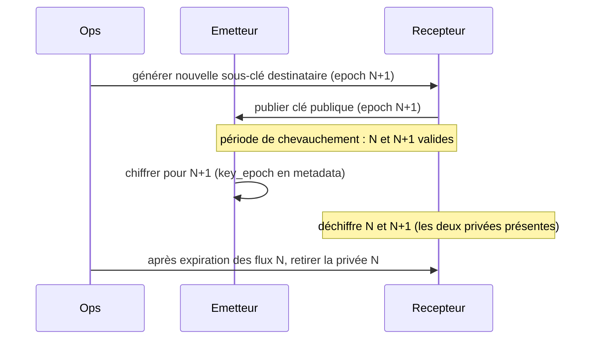

# 06 — Chiffrement (OpenPGP)

Le chiffrement est **configurable par règle** (voir [05 §2.7](05-configuration.md)). FileRouter
chiffre **et signe** avant le déplacement vers `exchange_out`, et **vérifie la signature puis
déchiffre** avant l'intégration entrante. L'implémentation passe par le port abstrait
`CryptoProvider`, ce qui rend le backend interchangeable et multi-plateforme.

## 1. Choix du backend

| Backend | Adaptateur | Avantages | Inconvénients |
|---------|-----------|-----------|---------------|
| **GnuPG** (`python-gnupg`) *(défaut)* | `GnuPGProvider` | Standard OpenPGP éprouvé en entreprise ; trousseau, rotation, sub-keys gérés par gpg ; disponible Linux **et** Windows (Gpg4win) | Dépendance binaire à déployer |
| **PGPy** (python pur) | `PGPyProvider` | Aucune dépendance binaire ; déploiement trivial ; idéal hôtes verrouillés | Maintenance communautaire moins active ; jeu d'algorithmes plus restreint |

Le port `CryptoProvider` expose un contrat unique ; le backend est sélectionné par
`encryption.backend`. La spec recommande **GnuPG** en production (robustesse et conformité),
PGPy restant une alternative valide là où l'installation du binaire gpg est indésirable.

```text
CryptoProvider (port)
├── encrypt(clear_path, recipients, sign_with) -> payload_path
├── decrypt(payload_path) -> clear_path
├── sign(clear_path, key_id) -> signature
├── verify(payload_path) -> VerificationResult(signer_key_id, valid)
├── list_keys() -> [KeyInfo]
└── current_recipient_keys(epoch) -> [key_id]
```

## 2. Architecture OpenPGP


- **Chiffrement** : pour la/les clé(s) publique(s) du **destinataire** (`recipient_key_ids`).
- **Signature** : avec la clé privée de **signature** de l'émetteur (`signing_key_id`).
- **Vérification entrante** : avec la clé publique de signature de l'émetteur (importée dans
  le trousseau du récepteur).
- **Déchiffrement** : avec la clé privée du destinataire (présente sur l'hôte récepteur).
- **Mode** : chiffrement OpenPGP hybride standard (session symétrique AES-256, clé de session
  protégée par la clé publique RSA-4096 ou ECC Curve25519). Format binaire (non-armored) pour
  l'efficacité ; armored optionnel via config.

## 3. Modèle de clés

| Clé | Détenue par | Usage |
|-----|-------------|-------|
| Paire **destinataire** | Hôte récepteur (privée) + émetteurs (publique) | Chiffrement/déchiffrement |
| Paire **signature** | Hôte émetteur (privée) + récepteurs (publique) | Signature/vérification |

- Une **master key** par identité, avec des **sous-clés** dédiées (chiffrement, signature),
  conformément aux bonnes pratiques OpenPGP. La master key reste hors-ligne ; seules les
  sous-clés sont déployées sur les serveurs.
- Les clés privées de serveur sont protégées par passphrase, fournie via un **secret
  d'environnement** ou un coffre (jamais en clair dans le YAML). Voir
  [10 — Politique de sécurité](10-security-policy.md).
- Trousseaux isolés par instance (`encryption.gnupg_home`), permissions restreintes
  (propriétaire du service uniquement).

## 4. Rotation des clés



- **Chevauchement** : pendant la rotation, l'émetteur peut chiffrer vers l'ancien et le
  nouveau destinataire ; le récepteur conserve les deux clés privées tant que des flux à
  l'epoch N peuvent encore arriver.
- La metadata porte `encryption.key_epoch`, ce qui permet au récepteur de sélectionner la
  bonne clé et à l'exploitation de suivre la migration.
- **Révocation** : un certificat de révocation est pré-généré et stocké hors-ligne ; en cas
  de compromission, il est importé et publié, et la règle de chiffrement est mise à jour vers
  une nouvelle clé.
- **Cadence** recommandée : rotation des sous-clés tous les 12 mois (ou immédiate sur
  incident). Expiration des sous-clés configurée pour forcer la rotation.

## 5. Signature & vérification

- **Sortant** : la signature est apposée au moment du chiffrement (mode sign+encrypt). En
  l'absence de chiffrement mais avec signature requise, une signature détachée
  (`.sig`) peut être produite (configurable).
- **Entrant** : `require_signature_inbound: true` impose une signature **valide** d'un
  signataire **autorisé** (liste blanche des `signing_key_id` de confiance dérivée des
  `mappings`/trousseau). Une signature absente, invalide ou d'un signataire inconnu →
  `ERROR` + quarantaine, jamais d'intégration.
- Le `signer_key_id` vérifié est journalisé (log sécurité) et inscrit dans l'audit
  (`DECRYPTED`/`HASH_VALIDATED`).

## 6. Ordre d'opérations (rappel)

- **Sortant** : `clear_file_hash` (clair) → chiffrer+signer → `payload_file_hash` (payload).
- **Entrant** : vérifier `payload_file_hash` → vérifier signature + déchiffrer → vérifier
  `clear_file_hash` → déplacer. Voir [07 — Empreintes](07-hashing.md) pour la justification de
  cet ordre (détection d'altération avant toute opération cryptographique).

## 7. Gestion des erreurs cryptographiques

| Erreur | Traitement |
|--------|------------|
| Clé destinataire absente (sortant) | `ERROR`, quarantaine, alerte sécurité ; aucun fichier publié en clair par erreur |
| Signature invalide/absente (entrant) | `ERROR`, quarantaine, alerte sécurité |
| Déchiffrement impossible (mauvaise clé/epoch) | `ERROR`, quarantaine ; vérifier la rotation |
| Passphrase indisponible | Échec de démarrage (fail-fast) ou erreur par item selon config |
| Backend gpg indisponible | Échec de démarrage (sanity check du CryptoProvider au boot) |

Un **self-test cryptographique** est exécuté au démarrage (chiffrer/déchiffrer un échantillon
en mémoire) pour détecter immédiatement un trousseau ou un backend mal configuré.
