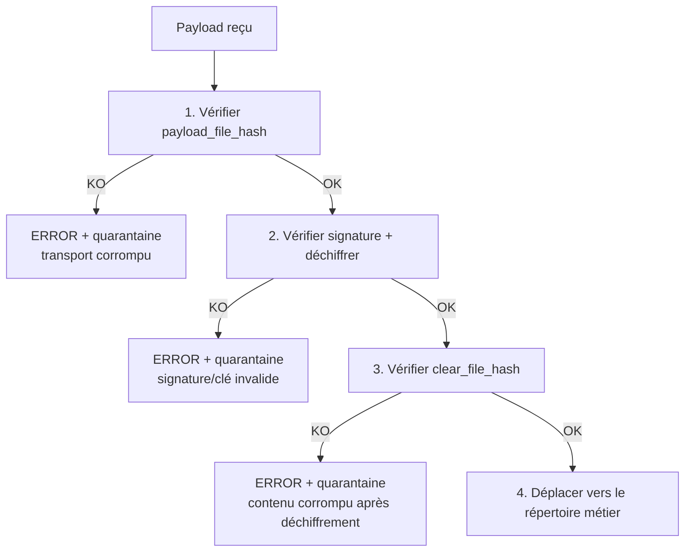

# 07 — Empreintes (Hashing)

## 1. Algorithme imposé

```text
SHA-256
```

Aucun autre algorithme n'est autorisé pour l'intégrité des fichiers. La valeur est stockée en
hexadécimal minuscule (64 caractères) dans la metadata.

## 2. Deux empreintes par fichier

### 2.1 Hash du fichier clair (`clear_file_hash`)
Calculé **avant** chiffrement, sur le contenu métier d'origine.
```json
{ "clear_file_hash": { "algorithm": "SHA-256", "value": "" } }
```
Garantit l'intégrité **de bout en bout** du contenu métier, indépendamment du chiffrement.

### 2.2 Hash du payload (`payload_file_hash`)
Calculé **après** chiffrement, sur le fichier transporté.
```json
{ "payload_file_hash": { "algorithm": "SHA-256", "value": "" } }
```
Garantit l'intégrité **de transport** : détecte toute altération du payload **avant** toute
opération cryptographique côté récepteur.

> Si `encrypted == false`, le payload est le fichier clair et
> `payload_file_hash == clear_file_hash`.

## 3. Calcul en flux

Les empreintes sont calculées **en streaming** par blocs de `hashing.chunk_size_bytes` (1 Mio
par défaut), à mémoire constante quelle que soit la taille du fichier. Le même flux de lecture
sert au calcul et à la copie pour éviter une double lecture disque.

## 4. Ordre de validation (entrant) — strict



1. **Vérifier le hash du payload.** Détecte une corruption de transport **sans** dépenser de
   ressource cryptographique ni risquer de traiter un payload falsifié.
2. **Déchiffrer** (après vérification de signature).
3. **Vérifier le hash du fichier clair.** Confirme que le contenu métier déchiffré est
   bit-à-bit identique à l'original.
4. **Déplacer** le fichier vers sa destination finale.

Cet ordre est une exigence de sécurité : aucune donnée n'est intégrée si l'une des trois
vérifications échoue ; tout échec entraîne `ERROR` + quarantaine, jamais une intégration
partielle.

## 5. Événements d'audit associés

| Moment | Événement | `details.target` |
|--------|-----------|-------------------|
| Sortant, après calcul clair | `HASH_COMPUTED` | `clear` |
| Sortant, après calcul payload | `HASH_COMPUTED` | `payload` |
| Entrant, payload vérifié | `HASH_VALIDATED` | `payload` |
| Entrant, clair vérifié | `HASH_VALIDATED` | `clear` |

Chaque événement consigne `algorithm` et `value`, rendant la chaîne d'intégrité entièrement
auditable et rejouable.

## 6. Comparaison sûre

La comparaison des empreintes utilise une comparaison à temps constant
(`hmac.compare_digest`) pour éviter toute fuite par canal temporel, bien que l'usage soit
principalement de l'intégrité (les valeurs ne sont pas secrètes).
