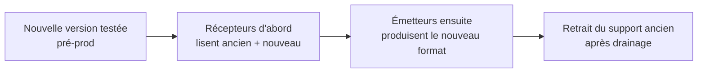

# 15 — Versionnement & montée de version

## 1. Schéma de versionnement

- **Application** : SemVer `MAJEUR.MINEUR.CORRECTIF`.
  - MAJEUR : rupture de compatibilité (config, format metadata/audit, protocole d'échange).
  - MINEUR : fonctionnalité rétro-compatible.
  - CORRECTIF : correction rétro-compatible.
- **Schémas de données** : `schema_version` indépendant dans la metadata (et l'audit), versionné
  séparément de l'application. Le binaire annonce les versions de schéma qu'il sait lire/écrire.

## 2. Compatibilité des artefacts

| Artefact | Règle de compatibilité |
|----------|------------------------|
| **metadata** | Le récepteur doit lire toute `schema_version` ≤ la sienne ; les champs inconnus sont ignorés (tolérance ascendante). |
| **audit** | Append-only ; jamais de migration destructive ; nouveaux événements additifs. |
| **config** | Validée par schéma ; nouveaux champs avec défauts ; champs retirés tolérés une version (warning) avant suppression. |
| **nom technique** | Le motif est porté dans la metadata (`naming`) → un récepteur reconstruit sans dépendre du motif émetteur. |

> Principe clé : l'**émetteur et le récepteur peuvent être à des versions différentes**. Seul
> l'`alias` et la metadata (auto-descriptive) circulent ; le récepteur n'a pas besoin de
> connaître la config de l'émetteur.

## 3. Stratégie de déploiement

- **Récepteurs avant émetteurs** : on met d'abord à niveau les hôtes qui *lisent* (tolérance
  ascendante), puis ceux qui *écrivent*. Évite qu'un récepteur ancien reçoive un format qu'il
  ne sait pas lire.
- **Rolling upgrade** : les instances étant indépendantes (état FS local), elles se mettent à
  jour une par une sans coordination centrale.
- **Arrêt propre** avant upgrade ([13](13-operations-guide.md)) ; la réconciliation au
  redémarrage reprend les traitements en cours.

## 4. Migration de schéma (sans base de données)

- Les artefacts existants (audit, archive) ne sont **pas** migrés en masse — ils restent
  lisibles via la tolérance ascendante.
- Si une migration est nécessaire (rare), un outil `filerouter migrate --from X --to Y`
  transforme les fichiers de façon **idempotente et interruptible** (write-then-rename),
  audité dans le flux admin.
- Aucun verrou global : la migration opère fichier par fichier.

## 5. Procédure d'upgrade

1. Lire les notes de version (ruptures, migrations).
2. Valider la config sur la nouvelle version : `filerouter validate-config`.
3. Déployer en pré-production, exécuter la suite de tests ([18](18-testing-strategy.md)) et un
   test de bout en bout émetteur↔récepteur.
4. Mettre à niveau les **récepteurs**, vérifier health/trace.
5. Mettre à niveau les **émetteurs**.
6. Surveiller backlog/quarantaine/intégrité après bascule.
7. Conserver la version précédente pour rollback rapide.

## 6. Rollback

- L'état sur FS étant compatible descendant dans la même MAJEUR, un rollback se fait en
  réinstallant la version antérieure et en redémarrant (la réconciliation reprend).
- Entre versions MAJEUR (format incompatible), le rollback nécessite de ne pas avoir encore
  produit d'artefacts au nouveau format chez des récepteurs anciens → d'où l'ordre
  « récepteurs avant émetteurs ».

## 7. Chaîne logicielle & CI

- Dépendances **figées** (`requirements.lock`), SBOM généré, scan de vulnérabilités à chaque
  build ([10 §7](10-security-policy.md)).
- Tests de **non-régression** obligatoires sur la compatibilité metadata/audit/config entre
  versions ([18](18-testing-strategy.md)).
