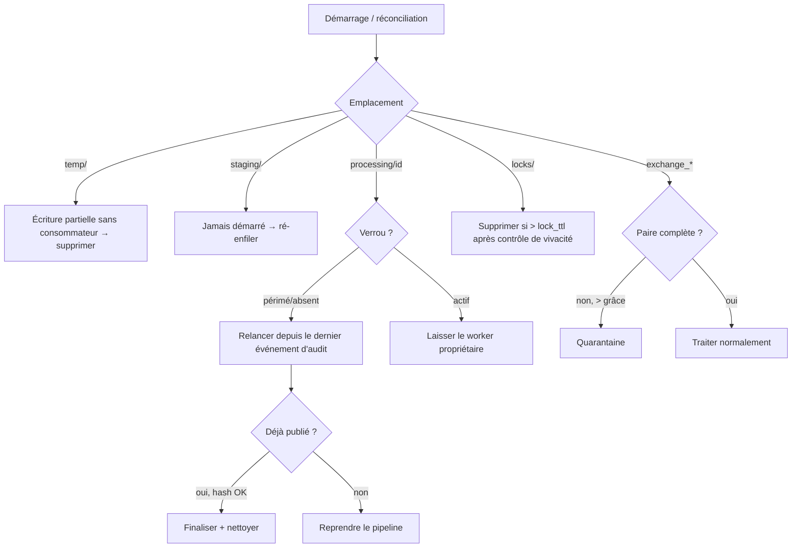

# 16 — Reprise après incident

L'application doit survivre aux redémarrages Windows, aux crashs Python, aux coupures réseau,
aux arrêts brutaux, aux fichiers incomplets et aux traitements interrompus — **sans perte ni
double publication**. La reprise repose entièrement sur l'état filesystem et l'idempotence
(voir [03 — Gestion d'état](03-state-management.md)).

## 1. Invariants de reprise

1. Toute transition est un **renommage atomique** → tout crash laisse le système dans un état
   fini connu.
2. Tout artefact visible est publié via **temp-puis-renommage** → jamais de fichier partiel
   visible.
3. Toute étape est **idempotente** → la relance ne duplique pas l'effet.
4. L'**audit** enregistre le dernier état atteint → la reprise sait où reprendre.
5. Au moindre doute → **quarantaine**, jamais de suppression.

## 2. Réconciliation au démarrage

Exécutée systématiquement au boot (et périodiquement), elle classe chaque artefact résiduel :

## 3. Détection des fichiers orphelins

| Orphelin | Détection | Action |
|----------|-----------|--------|
| Partiel `temp/` | présence dans `temp/`, âge > `temp_orphan_max_age` | suppression |
| `*.partial` cross-volume | suffixe `.partial` | suppression |
| `processing/` sans verrou | répertoire présent, pas de lock actif | relance idempotente |
| Paire incomplète (échange) | payload sans meta ou inverse, > grâce | quarantaine |
| Item dans `staging/` | présent, jamais traité | ré-enfiler |
| Verrou abandonné | `heartbeat_at` > `lock_ttl` | reaper le reprend |

## 4. Reprise des traitements interrompus

- Le pipeline reprend **depuis le dernier événement d'audit** : par ex. si `ENCRYPTED` est
  présent mais pas `MOVED_TO_EXCHANGE_OUT`, on reprend au calcul du payload-hash/metadata sans
  refaire le chiffrement si le payload existe déjà et que son hash correspond.
- Si la publication finale a déjà eu lieu (fichier présent à destination + hash conforme) mais
  que la finalisation (archive/suppression source) a été interrompue, on **finalise** seulement.
- Les étapes coûteuses (hash, chiffrement) sont **réutilisées** si leur sortie est présente et
  valide, sinon **recalculées** (idempotence garantie).

## 5. Gestion des fichiers bloqués

- **Verrou périmé** : repris par le reaper après `lock_ttl` + contrôle de vivacité du
  propriétaire (PID/hôte).
- **Fichier en cours d'écriture par un tiers** : non détecté tant que le contrôle de taille
  stable n'est pas satisfait ([03 §7](03-state-management.md)).
- **Item irrécupérable** (erreur déterministe répétée) : quarantaine après épuisement des
  retries ; jamais de boucle infinie (compteur d'essais dans l'audit).

## 6. Gestion des doublons à la reprise

Si un `technical_id` possède déjà un événement d'audit terminal de succès, la réapparition est
un doublon et suit la politique de [09 §5](09-error-handling.md) (`skip` par défaut). La
reprise ne republie donc jamais un fichier déjà livré.

## 7. Scénarios & comportement attendu

| Scénario | Comportement |
|----------|--------------|
| Redémarrage Windows en plein traitement | réconciliation reprend `processing/` ; aucun fichier perdu |
| Crash Python | verrou périmé repris ; pipeline relancé depuis l'audit |
| Coupure courant pendant un renommage | renommage atomique : soit l'ancien soit le nouveau nom existe, jamais entre les deux |
| Coupure pendant une copie cross-volume | seul un `*.partial` subsiste → supprimé |
| Échange réseau coupé (transport externe) | hors périmètre ; les fichiers restent dans l'échange, retraités à la reprise du transport |
| Fichier incomplet déposé | non détecté (stabilité) ou paire incomplète → quarantaine après grâce |
| Disque plein en cours d'écriture | erreur IO transitoire → retry → quarantaine ; alerte disque |

## 8. RTO / RPO

- **RPO ≈ 0** : aucun artefact validé n'est perdu (atomicité + audit) ; au pire un traitement
  est **rejoué**, jamais perdu.
- **RTO** : durée de la réconciliation au démarrage (proportionnelle au nombre d'items
  résiduels, généralement faible) + redémarrage du service. La réconciliation est
  parallélisable et interruptible.

## 9. Plan de reprise (sinistre majeur)

1. Restaurer l'hôte/OS et le venv applicatif.
2. Restaurer config, `keys/` (sauvegarde chiffrée hors-ligne) et `runtime/audit/`.
3. Les répertoires volatils (`processing/`, `staging/`, `temp/`, `locks/`) n'ont pas besoin de
   restauration — recréés/nettoyés au boot.
4. Démarrer le service ; la réconciliation reprend les items présents dans l'échange et le
   runtime restauré.
5. Vérifier health, backlog, quarantaine, intégrité ([13](13-operations-guide.md)).
