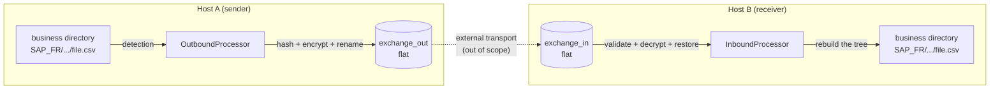

# 00 — Overview

## 1. Purpose

FileRouter is a **local file router**. It performs **no network transport**.
The actual transfer of files between sites is handled by an external mechanism out of
scope (MFT, replication, shared storage, etc.). FileRouter interacts only with the
**local file system**:

- **business directories** (`base_folders`) — the source/destination trees, of
  arbitrary depth;
- a flat outbound exchange directory (`exchange_out`);
- a flat inbound exchange directory (`exchange_in`).

## 2. Responsibilities

FileRouter is responsible for:

1. **Detecting** files appearing in business directories (outbound) or in
   `exchange_in` (inbound).
2. **Computing metadata** (origin alias, relative path, original name,
   timestamps).
3. **Computing SHA-256 hashes** of the clear file and of the encrypted payload.
4. **Encrypting/decrypting** files according to configurable rules (OpenPGP), including
   **signing** and **signature verification**.
5. **Renaming** files with a configurable technical name, readable by support.
6. **Moving** files between the business trees and the flat exchange directories.
7. **Rebuilding** the business tree on the receiving side from the transported metadata.
8. **Producing audit files** allowing the full history of each file to be reconstructed.
9. **Producing operational logs** for support, security and administration.

## 3. Scope limits (non-goals)

| In scope | Out of scope |
|-------------------|----------------|
| Local detection, hash, crypto, renaming, moving | Network transport of files |
| State and audit on the file system | Any database (SQLite, SQL, remote) |
| Multi-platform core (Linux + Windows) | GUI / interactive front end |
| Native Windows service + Linux systemd | Windows Task Scheduler (excluded) |
| OpenPGP encryption/signing | Home-grown cryptography |

## 4. Hard constraints

- **No database.** State, audit and locking only on the file system.
- **Unlimited `base_folders`.** Any number of business roots, declared by alias.
- **Unlimited tree depth.** No assumption about nesting; relative paths
  are computed dynamically.
- **Flat exchange directories.** `exchange_in` / `exchange_out` never contain a
  subdirectory.
- **Transport by alias only.** Only the business *alias* travels with the file; the
  physical paths are local to each host and may differ from one server to another.
- **SHA-256** is the mandated hash algorithm.
- **No hard-coded business parameters.** Everything configurable lives in the YAML.

## 5. Key concepts & glossary

| Term | Definition |
|-------|------------|
| **base_folder** | A declared business root, identified by a stable `alias` and a host-local `path`. Each file belongs to exactly one base_folder. |
| **alias** | Host-independent logical identifier of a base_folder (e.g. `SAP_FR`). The only routing key transported between hosts. |
| **relative_path** | Path of a file relative to the root of its base_folder, POSIX-normalized, of unlimited depth. |
| **exchange_out / exchange_in** | Flat exchange directories at the boundary with the external transport. |
| **technical_id** | Globally unique identifier (ULID/UUIDv4) assigned to a file as soon as it is detected; the primary correlation key between metadata, audit and logs. |
| **technical name** | Configurable, flat, support-readable file name used in the exchange directories. |
| **metadata** | JSON file describing a routed file (alias, relative path, hashes, crypto state, …). |
| **payload** | The transported content (encrypted if a rule applies, otherwise the clear file). |
| **audit file** | Per-file, append-only JSON-Lines history of the events that change state. |
| **runtime/** | Technical state tree owned by FileRouter. |
| **CryptoProvider** | Port abstracting the OpenPGP backend (GnuPG via `python-gnupg`, or PGPy). |

## 6. Design principles

1. **The file system is the database.** Every durable fact is a file;
   every transition is an atomic rename. This is the major structuring constraint.
2. **Idempotence.** Each pipeline step can be re-run safely after a
   crash; reprocessing the same file produces the same result (key: `technical_id` +
   `clear_file_hash`).
3. **Atomicity over locking.** Prefer atomic `os.replace` over a shared
   mutable state; locks are advisory and self-healing (TTL + heartbeat).
4. **Portability through isolation.** The core is pure Python on top of a small set
   of ports; OS/crypto/clock-specific behaviors live in adapters
   (hexagonal architecture).
5. **Observability by default.** Each step emits a correlated audit event and a
   structured log line, indexed by `technical_id`.
6. **Fail safe, never lose a file.** At the slightest doubt, a file is
   quarantined in `error/` with its context, never deleted nor silently lost.
7. **Configuration is a contract.** Behavior is driven by the YAML, validated by
   schema at startup; the binary embeds no business rule.

## 7. High-level flow

See [01 — Architecture](01-architecture.md) for the internal breakdown and
[02 — Flows](02-flows.md) for the detailed sequence diagrams.
