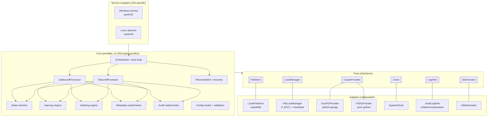

# 01 — Architecture

## 1. Architectural style

FileRouter adopts a **hexagonal (ports & adapters)** architecture with a strictly
portable core. This is what allows the same engine to run identically on
Windows Server and Linux, and to be exhaustively unit-tested without touching a
real file system or a real keyring.

### Rationale
- The **core depends only on the ports** (Python `Protocol`/ABC interfaces). It never
  imports `os`, `gnupg`, `win32service`, etc. directly.
- The **adapters** implement the ports with a concrete technology. Replacing GnuPG
  with PGPy, or a real clock with a frozen test clock, is a simple change of
  wiring.
- The **service wrappers** are the only OS-specific code and contain
  *no business logic* — they start/stop the orchestrator loop and
  translate OS lifecycle signals.

## 2. Components

### 2.1 Orchestrator (scan loop)
The portable daemon. At each tick (configurable `scan_interval`) it:
1. runs the **startup reconciliation** once at boot (see [03](03-state-management.md));
2. enumerates the business directories for outbound work and `exchange_in` for inbound
   work, applying the inclusion/exclusion rules;
3. dispatches eligible files to the worker pool;
4. honors a cooperative shutdown flag for a clean service stop.

Concurrency: a bounded worker pool (threads or processes, configurable). Coordination
between workers happens **only through file locks** — no shared in-memory state,
so the same design works across multiple processes, or even multiple hosts
sharing the storage.

### 2.2 OutboundProcessor
Implements the 10-step outbound pipeline (detect → identify base_folder → relative
path → rules → hash → encrypt → metadata → technical name → move to `exchange_out`
→ audit → archive/delete the source). Each step is idempotent and emits an audit
event. See [02 — Flows](02-flows.md).

### 2.3 InboundProcessor
Implements the 8-step inbound pipeline (load metadata → verify payload hash →
decrypt → resolve the target base_folder → recompute the business path → restore the
original name → move to the business directory → audit). The verification order is strict;
see [07 — Hashing](07-hashing.md).

### 2.4 State machine
Owns the legal transitions between the `runtime/` states and the **atomic** operations
that perform them. Single authority on "which move is allowed next".

### 2.5 Naming engine
Generates the configurable technical name from a placeholder pattern, applies the
maximum length, guarantees a unique `technical_id`, and provides the **inverse mapping**
used inbound to restore the original name from the metadata. See
[04 — Data formats](04-data-formats.md).

### 2.6 Hashing engine
Computes SHA-256 streaming over large files (constant memory). Computes the **clear
hash** before encryption and the **payload hash** after. See [07](07-hashing.md).

### 2.7 Metadata & audit writers
Serialize/validate the metadata and append the audit events. Both write into
`temp/` then **rename atomically** into place, so that a reader never sees a
partial file.

### 2.8 Reconciliation / recovery
At startup and periodically, scans `staging/`, `processing/`, `temp/` and `locks/` to
detect orphans, stale locks and interrupted transitions, then relaunches
or quarantines them. See [16 — Disaster recovery](16-disaster-recovery.md).

### 2.9 Config model
Loads the YAML, validates it via [`config.schema.json`](../schemas/config.schema.json), resolves the
host-local `base_folders` paths, compiles the inclusion/exclusion and encryption
rules. An invalid config aborts startup (fail-fast).

## 3. Ports (interfaces)

| Port | Responsibility | Default adapter |
|------|----------------|-----------------------|
| `FileStore` | Atomic move/copy/rename, fsync, stat, enumeration, stable-size check | `LocalFileStore` (os/pathlib) |
| `LockManager` | Acquire/release advisory locks, heartbeat, stale detection | `FileLockManager` (`O_EXCL`) |
| `CryptoProvider` | Encrypt, decrypt, sign, verify, key lookup/rotation | `GnuPGProvider` / `PGPyProvider` |
| `Clock` | Monotonic time + wall clock, timestamp formatting | `SystemClock` |
| `LogSink` | Structured JSON-Lines emission, rotation/compression | `JsonlLogSink` |
| `IdGenerator` | Unique `technical_id` | `UlidGenerator` |

## 4. Data ownership

| Data | Owner | Format | Location |
|--------|--------------|--------|-------------|
| Routed file content | FileStore | binary | business tree / exchange / runtime |
| Metadata | Metadata writer | JSON | next to the payload + `runtime/processing` |
| Audit | Audit writer | JSON-Lines | `runtime/audit/<technical_id>.audit.json` |
| Locks | LockManager | JSON | `runtime/locks/<key>.lock` |
| Logs | LogSink | JSON-Lines | `logs/<stream>/…` |
| Config | Config model | YAML | external, read-only at runtime |

## 5. Concurrency & consistency model

- **A single writer per file**, guaranteed by a lock named after the `technical_id`
  (or, before an id is assigned, after a stable hash of the absolute source path).
- **Atomic publication**: any externally visible artifact (payload, metadata, audit)
  is produced in `temp/` then made visible by a single atomic rename.
- **No partial reads**: consumers only ever see fully
  written files, thanks to the temp-then-rename discipline.
- **Crash consistency**: since every transition is an atomic rename, any crash leaves
  the system in one of the finite, recoverable states understood by the reconciliation step.

## 6. Multi-platform considerations

- All paths via `pathlib.PurePath`/`Path`; relative paths are stored
  POSIX-normalized in the metadata so they transit between Windows and Linux hosts.
- Atomic rename: `os.replace` (atomic on NTFS and POSIX **within a volume**);
  cross-volume is handled by copy-to-temp + fsync + rename (see [03](03-state-management.md)).
- Name portability: technical names restricted to a portable character set;
  case sensitivity and reserved Windows names handled by the naming engine.
- No dependency on POSIX-only semantics (e.g. deleting an open file);
  Windows locking quirks are handled by the `FileStore`'s stable-size/retry
  checks.
