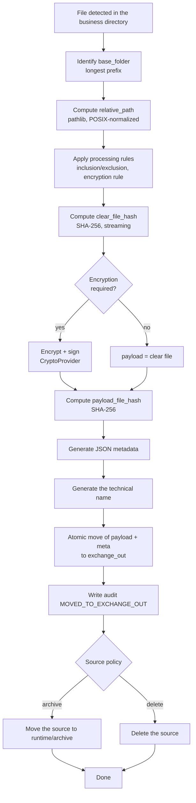
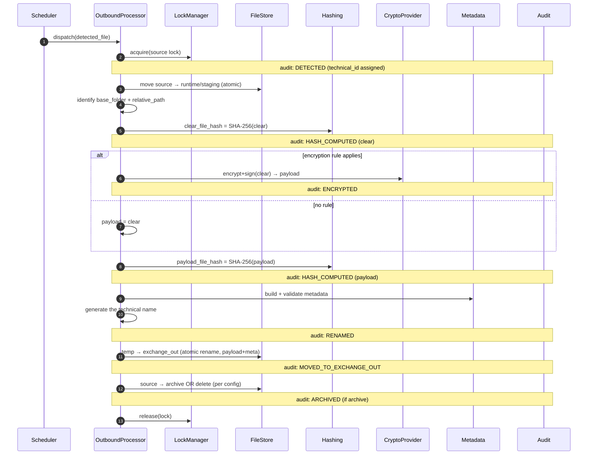
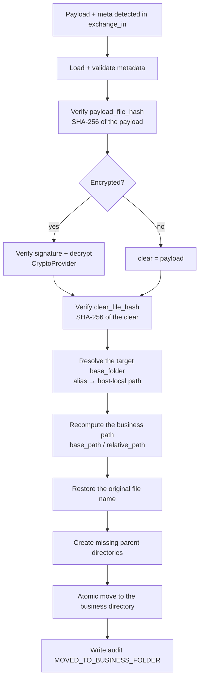
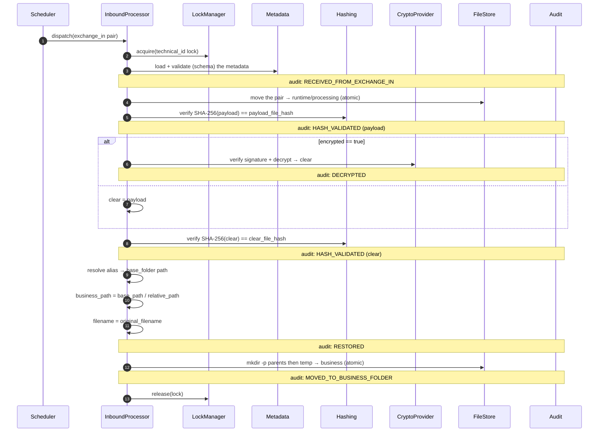
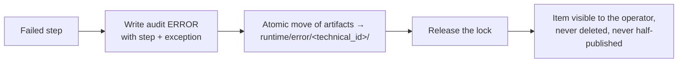

# 02 — Flows

This document specifies the **outbound** and **inbound** pipelines as flow
and sequence diagrams. Each step is annotated with the audit event it emits (see
[04 — Data formats](04-data-formats.md)) and the `runtime/` directory the
file occupies (see [03 — State management](03-state-management.md)).

## 1. Outbound pipeline (business → exchange_out)

### Outbound sequence diagram

### Step ↔ audit ↔ state mapping (outbound)

| # | Step | Audit event | Runtime state |
|---|-------|-------------------|--------------|
| 1 | Detect, assign `technical_id` | `DETECTED` | `staging/` |
| 2 | Identify base_folder | — | `staging/` |
| 3 | Compute relative_path | — | `staging/` |
| 4 | Apply the rules | — | `processing/` |
| 5 | Clear hash | `HASH_COMPUTED` | `processing/` |
| 6 | Encrypt+sign (if rule) | `ENCRYPTED` | `processing/` |
| 7 | Payload hash | `HASH_COMPUTED` | `processing/` |
| 8 | Build metadata | — | `processing/` |
| 9 | Technical name | `RENAMED` | `processing/` → `temp/` |
| 10 | Move to exchange_out | `MOVED_TO_EXCHANGE_OUT` | `exchange_out/` |
| 11 | Archive/delete source | `ARCHIVED` / — | `archive/` or deleted |

## 2. Inbound pipeline (exchange_in → business)

### Inbound sequence diagram

### Step ↔ audit ↔ state mapping (inbound)

| # | Step | Audit event | Runtime state |
|---|-------|-------------------|--------------|
| 1 | Detect the pair, lock | `RECEIVED_FROM_EXCHANGE_IN` | `exchange_in/` → `processing/` |
| 2 | Load+validate metadata | — | `processing/` |
| 3 | Verify payload hash | `HASH_VALIDATED` | `processing/` |
| 4 | Verify sig + decrypt | `DECRYPTED` | `processing/` |
| 5 | Verify clear hash | `HASH_VALIDATED` | `processing/` |
| 6 | Resolve base_folder | — | `processing/` |
| 7 | Recompute path + restore name | `RESTORED` | `processing/` → `temp/` |
| 8 | Move to the business directory | `MOVED_TO_BUSINESS_FOLDER` | business tree |

## 3. Error path (both pipelines)

Any uncaught failure at any step:

Quarantined items are **never** deleted automatically. Recovery and
replay are covered in [09 — Error handling](09-error-handling.md) and
[16 — Disaster recovery](16-disaster-recovery.md).
