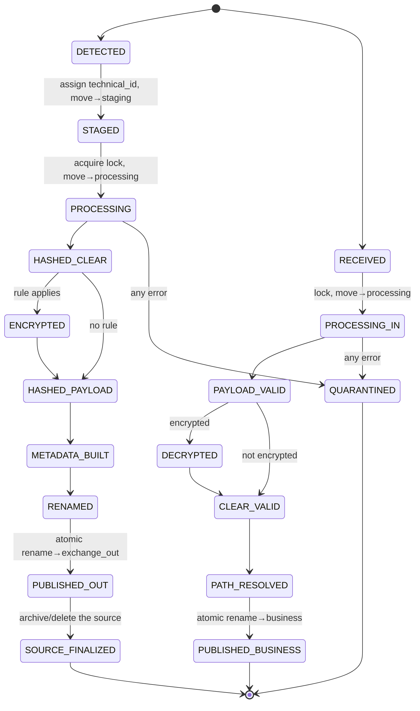
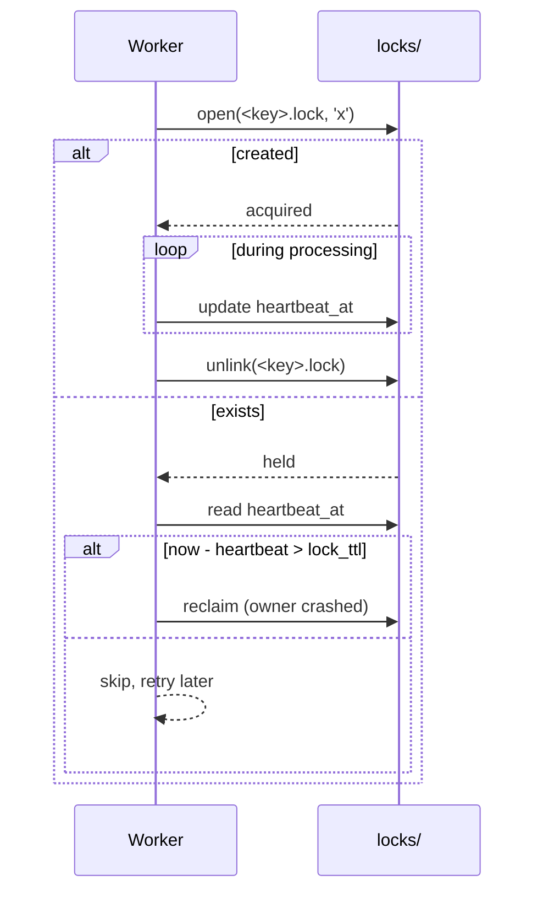

# 03 — State management

All state is kept on the file system. There is **no database**. This
document defines the layout of the technical directories, the per-file state machine,
the atomic operations that perform the transitions, the locking protocol and the
crash-recovery semantics.

## 1. The `runtime/` tree

```text
runtime/
├── staging/      # freshly detected items, technical_id assigned, not yet processed
├── processing/   # items being processed in a pipeline
├── archive/      # source files kept after a successful outbound (per config)
├── error/        # quarantined items + their context (one subdir per technical_id)
├── audit/        # per-file audit logs, append-only (<technical_id>.audit.json)
├── locks/        # advisory lock files (<key>.lock)
└── temp/         # scratch area for in-progress writes before atomic publication
```

> `runtime/` MUST reside on the **same volume** as the exchange directories so that the
> publication operations are intra-volume atomic renames. If the business
> directories are on other volumes, cross-volume copies are handled explicitly
> (see §4.2).

| Directory | Role | Lifetime | Cleaned by |
|------------|------|--------------|-------------|
| `staging/` | Holds detected items between detection and the start of processing. Decouples detection from processing throughput. | Short | Reconciliation (relaunch) |
| `processing/` | The working set; exactly the files a worker currently owns (lock held). | Short | Reconciliation (relaunch of stale items) |
| `archive/` | Outbound sources kept for traceability/reprocessing. | Per retention | Retention sweep ([11](11-archival-retention.md)) |
| `error/` | Quarantine. One subdirectory per failed `technical_id`, containing payload, metadata snapshot and an `error.json`. | Until operator action | Operator / replay tool |
| `audit/` | Durable per-file history. | Per retention | Retention sweep |
| `locks/` | Advisory locks with heartbeat. | Tied to processing | Stale-lock reaper |
| `temp/` | Scratch for partial writes; nothing here is ever externally visible. | Very short | Reconciliation (orphan purge) |

## 2. Per-file state machine



The current state of a file is **implicit in its location** plus its audit trail. There
is no separate state field to keep synchronized — the directory *is* the state. This is
what makes crash recovery deterministic.

## 3. Transition table (excerpt)

| From (location) | Trigger | Atomic op. | To (location) | Audit |
|----------------------|-------------|--------------|--------------------|-------|
| business directory | detection | `os.replace` | `staging/<id>__<orig>` | `DETECTED` |
| `staging/` | lock acquired | `os.replace` | `processing/<id>/` | — |
| `processing/` | metadata+name ready | write to `temp/`, `os.replace` | `exchange_out/<techname>` | `MOVED_TO_EXCHANGE_OUT` |
| `processing/` | success | `os.replace`/`unlink` | `archive/` or deleted | `ARCHIVED` |
| `exchange_in/` | detection | `os.replace` | `processing/<id>/` | `RECEIVED_FROM_EXCHANGE_IN` |
| `processing/` | validated+restored | `os.replace` | business directory | `MOVED_TO_BUSINESS_FOLDER` |
| `processing/` | error | `os.replace` | `error/<id>/` | `ERROR` |

## 4. Atomic operations

### 4.1 Intra-volume (common case)
- **`os.replace(src, dst)`** is atomic on NTFS and POSIX. Used for every publication
  and every state move within the runtime/exchange volume.
- **Write-then-rename**: payload, metadata and audit are first written into `temp/`,
  `fsync`ed, then `os.replace`d to their final name. A reader therefore never observes a
  partial file.

### 4.2 Cross-volume (business directory on another disk)
`os.replace` is not atomic across volumes. The `FileStore` adapter performs:
1. copy `src` → `dst.partial` on the destination volume;
2. `fsync` the destination file and its directory;
3. `os.replace(dst.partial, dst)` (intra-volume, atomic);
4. size/hash check, then deletion of `src`.
A crash before step 3 leaves only a `*.partial` file, purged by reconciliation.

### 4.3 Directory durability
After creating the business subdirectories inbound, the parent directory is `fsync`ed
(where the platform allows it) so that the tree survives a power outage.

## 5. Locking protocol

- **Lock file**: `runtime/locks/<key>.lock`, created with `O_EXCL` (`open(..., 'x')`)
  — an atomic test-and-set. Successful creation = lock acquired; `FileExistsError` =
  held elsewhere.
- **Key**: `technical_id` once assigned; before that, a stable hash of the absolute
  source path (so the same source is not picked up twice in parallel).
- **Content** (JSON): `{host, pid, technical_id, acquired_at, heartbeat_at, stage}`.
- **Heartbeat**: the owning worker rewrites `heartbeat_at` every
  `heartbeat_interval`.
- **Stale detection**: a lock whose `heartbeat_at` is older than `lock_ttl`
  (≫ heartbeat interval) is considered abandoned (owner crash). The reaper
  verifies that the owner is really gone (PID/host check if possible) before
  reclaiming it.
- **Release**: deletion of the lock file (best-effort; a residual stale lock
  is self-healing via the TTL).



## 6. Recovery semantics (startup reconciliation)

Run once at boot then periodically:

1. **`temp/`** — anything there is an interrupted partial write with no
   consumer → delete.
2. **`processing/<id>/`** — interrupted pipeline. If the lock is stale/absent, relaunch
   from the last audit event (idempotent steps make this safe). If the
   move to the final destination has already happened (verified by presence + hash),
   simply finalize and clean up.
3. **`staging/`** — items never started → re-enqueue.
4. **`locks/`** — delete locks beyond `lock_ttl` after a liveness check of the
   owner.
5. **`exchange_out` / `exchange_in`** — a payload without its `.meta.json` (or vice versa) is
   an incomplete pair; wait `pair_grace_period`, then quarantine if
   still incomplete.
6. **Duplicates** — if a `technical_id` already has a terminal audit event, the
   re-detected copy is a duplicate (see [09 — Error handling](09-error-handling.md)).

Since every transition is a single atomic rename and every step is idempotent,
**every** crash point corresponds to exactly one of the cases above. No state is
ever ambiguous. Full disaster recovery is detailed in
[16 — Disaster recovery](16-disaster-recovery.md).

## 7. File stability detection

A file still being written by a producer must not be picked up.
Before detection, `FileStore` applies a **stable-size check**: the file's size and
mtime must remain unchanged over `stability_checks` consecutive probes
spaced `stability_interval` apart. On Windows, an additional exclusive-open
probe detects files still locked by the writer.
