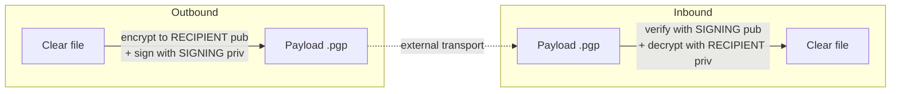
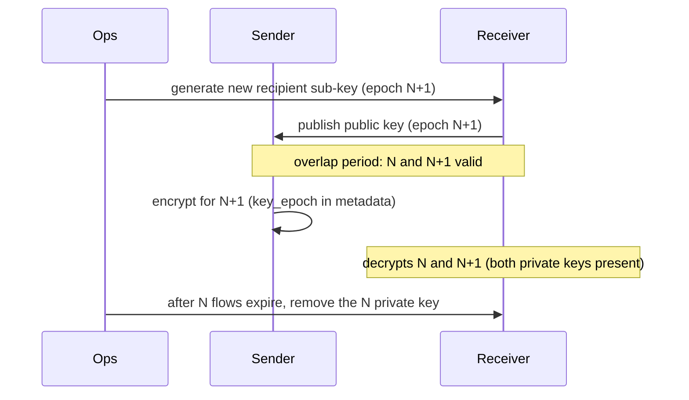

# 06 — Encryption (OpenPGP)

Encryption is **configurable per rule** (see [05 §2.7](05-configuration.md)). FileRouter
encrypts **and signs** before the move to `exchange_out`, and **verifies the signature then
decrypts** before inbound integration. The implementation goes through the abstract
`CryptoProvider` port, which makes the backend interchangeable and multi-platform.

## 1. Backend choice

| Backend | Adapter | Pros | Cons |
|---------|-----------|-----------|---------------|
| **GnuPG** (`python-gnupg`) *(default)* | `GnuPGProvider` | Enterprise-proven OpenPGP standard; keyring, rotation, sub-keys managed by gpg; available on Linux **and** Windows (Gpg4win) | Binary dependency to deploy |
| **PGPy** (pure python) | `PGPyProvider` | No binary dependency; trivial deployment; ideal for locked-down hosts | Less active community maintenance; more restricted algorithm set |

The `CryptoProvider` port exposes a single contract; the backend is selected by
`encryption.backend`. The spec recommends **GnuPG** in production (robustness and compliance),
PGPy remaining a valid alternative where installing the gpg binary is undesirable.

```text
CryptoProvider (port)
├── encrypt(clear_path, recipients, sign_with) -> payload_path
├── decrypt(payload_path) -> clear_path
├── sign(clear_path, key_id) -> signature
├── verify(payload_path) -> VerificationResult(signer_key_id, valid)
├── list_keys() -> [KeyInfo]
└── current_recipient_keys(epoch) -> [key_id]
```

## 2. OpenPGP architecture



- **Encryption**: for the **recipient**'s public key(s) (`recipient_key_ids`).
- **Signing**: with the sender's **signing** private key (`signing_key_id`).
- **Inbound verification**: with the sender's signing public key (imported into
  the receiver's keyring).
- **Decryption**: with the recipient's private key (present on the receiving host).
- **Mode**: standard hybrid OpenPGP encryption (symmetric AES-256 session, session key
  protected by the RSA-4096 or ECC Curve25519 public key). Binary (non-armored) format for
  efficiency; armored optional via config.

## 3. Key model

| Key | Held by | Use |
|-----|-------------|-------|
| **Recipient** pair | Receiving host (private) + senders (public) | Encryption/decryption |
| **Signing** pair | Sending host (private) + receivers (public) | Signing/verification |

- One **master key** per identity, with dedicated **sub-keys** (encryption, signing),
  in line with OpenPGP best practices. The master key stays offline; only the
  sub-keys are deployed on the servers.
- Server private keys are protected by passphrase, supplied via an **environment
  secret** or a vault (never in clear in the YAML). See
  [10 — Security policy](10-security-policy.md).
- Keyrings isolated per instance (`encryption.gnupg_home`), restricted permissions
  (service owner only).

## 4. Key rotation



- **Overlap**: during rotation, the sender can encrypt to the old and the
  new recipient; the receiver keeps both private keys as long as flows at
  epoch N can still arrive.
- The metadata carries `encryption.key_epoch`, which lets the receiver select the
  right key and operations track the migration.
- **Revocation**: a revocation certificate is pre-generated and stored offline; in case
  of compromise, it is imported and published, and the encryption rule is updated to
  a new key.
- Recommended **cadence**: sub-key rotation every 12 months (or immediate on
  incident). Sub-key expiration configured to force rotation.

## 5. Signing & verification

- **Outbound**: the signature is applied at encryption time (sign+encrypt mode). In
  the absence of encryption but with signing required, a detached signature
  (`.sig`) can be produced (configurable).
- **Inbound**: `require_signature_inbound: true` mandates a **valid** signature from an
  **authorized** signer (whitelist of trusted `signing_key_id` derived from the
  `mappings`/keyring). A missing, invalid or unknown-signer signature →
  `ERROR` + quarantine, never an integration.
- The verified `signer_key_id` is logged (security log) and recorded in the audit
  (`DECRYPTED`/`HASH_VALIDATED`).

## 6. Order of operations (reminder)

- **Outbound**: `clear_file_hash` (clear) → encrypt+sign → `payload_file_hash` (payload).
- **Inbound**: verify `payload_file_hash` → verify signature + decrypt → verify
  `clear_file_hash` → move. See [07 — Hashing](07-hashing.md) for the rationale of
  this order (tampering detection before any cryptographic operation).

## 7. Cryptographic error handling

| Error | Treatment |
|--------|------------|
| Missing recipient key (outbound) | `ERROR`, quarantine, security alert; no file ever published in clear by mistake |
| Invalid/missing signature (inbound) | `ERROR`, quarantine, security alert |
| Decryption impossible (wrong key/epoch) | `ERROR`, quarantine; check the rotation |
| Passphrase unavailable | Startup failure (fail-fast) or per-item error per config |
| gpg backend unavailable | Startup failure (CryptoProvider sanity check at boot) |

A **cryptographic self-test** is run at startup (encrypt/decrypt an in-memory
sample) to immediately detect a misconfigured keyring or backend.

## 8. Key generation & provisioning (Linux / Windows)

> FileRouter **does not generate** keys at runtime. Keys are created and distributed by
> operations, then imported into the service account's `gnupg_home` ([12 §7](12-deployment.md)).
> The commands below use GnuPG (backend `gnupg`), available on Linux and
> Windows (Gpg4win). Adapt the identities, key sizes and durations to your policy.

### 8.1 Prerequisites

| Platform | GnuPG installation |
|------------|-----------------------|
| **Linux (Debian/Ubuntu)** | `sudo apt-get install gnupg` |
| **Linux (RHEL/Rocky)** | `sudo dnf install gnupg2` |
| **Windows** | Install **Gpg4win** (<https://gpg4win.org>); `gpg.exe` is then in the `PATH`. |

> All `gpg` commands are **identical** on Linux and Windows. The only difference
> is the definition of `GNUPGHOME` (see 8.6) and the shell syntax for environment
> variables.

### 8.2 Generate a master key + sub-keys (non-interactive mode)

Using a parameter file makes generation reproducible and scriptable. Create
`keydef.txt`:

```text
%echo Generating FileRouter key
Key-Type: EDDSA
Key-Curve: ed25519
Key-Usage: sign
Subkey-Type: ECDH
Subkey-Curve: cv25519
Subkey-Usage: encrypt
Name-Real: FileRouter PAYMENT FRANKFURT
Name-Email: filerouter-payment@frankfurt.example.com
Expire-Date: 2y
%no-protection
%commit
%echo Done
```

Then:

**Linux**
```bash
gpg --batch --generate-key keydef.txt
```

**Windows (PowerShell)**
```powershell
gpg --batch --generate-key keydef.txt
```

> `%no-protection` generates **without a passphrase** — convenient for a test. In **production**,
> remove this line and supply a passphrase, stored outside the config (environment
> variable, Windows DPAPI/Credential Manager, Linux vault/systemd secret —
> see [10 §3](10-security-policy.md)).
> For a full ceremony (offline master key + deployed sub-keys),
> first generate the **sign-only** master key, then add the sub-keys via
> `gpg --expert --edit-key <KEYID>` → `addkey`.

### 8.3 Interactive generation (alternative)

```bash
gpg --full-generate-key
```
Choose an ECC type (recommended: ECC ed25519/cv25519) or RSA 4096, an expiration duration,
then the identity (Name/Email). Identical on Windows.

### 8.4 List, retrieve key identifiers

```bash
gpg --list-secret-keys --keyid-format long
gpg --list-keys --keyid-format long
```
The config's `signing_key_id` and `recipient_key_ids` are the long identifiers
(e.g. `0xCAFEBABE…`) or the fingerprints shown here.

### 8.5 Export / import (distribution between hosts)

On the **recipient** host, export the encryption **public key** to send to the
senders:

```bash
# Recipient: export ITS public key
gpg --armor --export filerouter-payment@frankfurt.example.com > payment-recipient-pub.asc
```

On each **sender** host, import this public key:

```bash
# Sender: import the recipient's public key
gpg --import payment-recipient-pub.asc
# Mark trust (otherwise a warning at encryption time)
gpg --edit-key filerouter-payment@frankfurt.example.com   # then: trust → 5 → quit
```

Reciprocally, export the sender's **signing public key** and import it on the
recipient (needed for **signature verification**, `require_signature_inbound`):

```bash
# Sender: export its signing public key
gpg --armor --export <SIGNING_KEYID> > paris-signer-pub.asc
# Recipient: import + trust
gpg --import paris-signer-pub.asc
```

> **Never** transmit private keys between hosts through this channel. Each host holds
> only: its encryption **private** key (if it is a recipient) / signing private key (if it is a
> sender), and the **public** keys of its correspondents.

### 8.6 Provisioning into the service's `gnupg_home`

FileRouter reads the keyring pointed to by `encryption.gnupg_home` ([05 §2.7](05-configuration.md)).
To generate/import directly into this dedicated keyring:

**Linux**
```bash
export GNUPGHOME=/var/lib/filerouter/keys/gnupg
mkdir -p "$GNUPGHOME" && chmod 700 "$GNUPGHOME"
gpg --batch --generate-key keydef.txt        # or --import *.asc
```

**Windows (PowerShell)**
```powershell
$env:GNUPGHOME = "D:\FileRouter\keys\gnupg"
New-Item -ItemType Directory -Force -Path $env:GNUPGHOME | Out-Null
gpg --batch --generate-key keydef.txt        # or --import *.asc
```

Restrict directory access to the **service account** only ([10 §4](10-security-policy.md)):
- Linux: `chown -R filerouter:filerouter "$GNUPGHOME" && chmod -R go-rwx "$GNUPGHOME"`.
- Windows: explicit ACL (service account in full control, removal of the others),
  e.g. `icacls D:\FileRouter\keys\gnupg /inheritance:r /grant "<service_account>:(OI)(CI)F`.

### 8.7 Backup & revocation

```bash
# Offline encrypted backup of the private key (to store in a safe place)
gpg --armor --export-secret-keys <KEYID> > filerouter-secret-backup.asc
# Pre-generate a revocation certificate (to keep offline)
gpg --output filerouter-revoke.asc --gen-revoke <KEYID>
```
See rotation/revocation in [§4](#4-key-rotation) and the secrets policy in
[10 §3](10-security-policy.md).

### 8.8 Quick check (smoke test)

```bash
echo "test filerouter" > sample.txt
gpg --yes --encrypt --sign \
    --recipient filerouter-payment@frankfurt.example.com \
    --local-user <SIGNING_KEYID> sample.txt          # → sample.txt.gpg
gpg --decrypt sample.txt.gpg                          # must show the content + valid signature
```
This test reproduces the outbound→inbound operation that FileRouter performs (encrypt+sign then
verify+decrypt) and validates the provisioning before the service starts.
