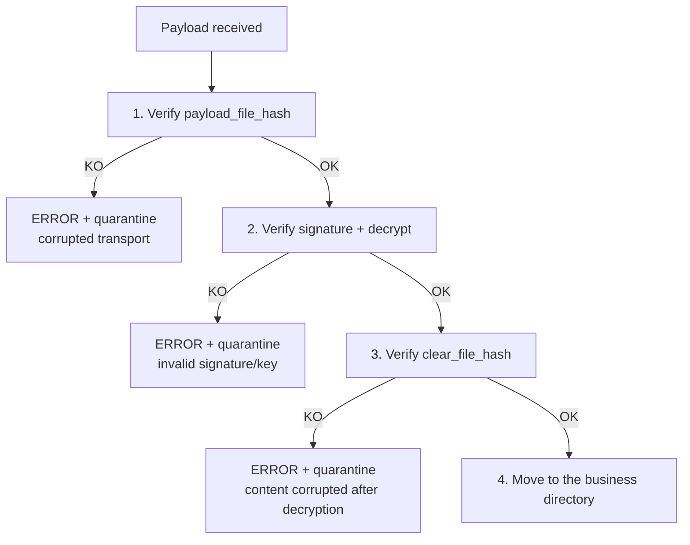

# 07 — Hashing

## 1. Mandated algorithm

```text
SHA-256
```

No other algorithm is allowed for file integrity. The value is stored in
lowercase hexadecimal (64 characters) in the metadata.

## 2. Two hashes per file

### 2.1 Clear file hash (`clear_file_hash`)
Computed **before** encryption, over the original business content.
```json
{ "clear_file_hash": { "algorithm": "SHA-256", "value": "" } }
```
Guarantees the **end-to-end** integrity of the business content, independently of encryption.

### 2.2 Payload hash (`payload_file_hash`)
Computed **after** encryption, over the transported file.
```json
{ "payload_file_hash": { "algorithm": "SHA-256", "value": "" } }
```
Guarantees **transport** integrity: detects any alteration of the payload **before** any
cryptographic operation on the receiver side.

> If `encrypted == false`, the payload is the clear file and
> `payload_file_hash == clear_file_hash`.

## 3. Streaming computation

Hashes are computed **in streaming** by blocks of `hashing.chunk_size_bytes` (1 MiB
by default), with constant memory regardless of the file size. The same read stream
serves both the computation and the copy to avoid a double disk read.

## 4. Validation order (inbound) — strict



1. **Verify the payload hash.** Detects a transport corruption **without** spending any
   cryptographic resource or risking processing a forged payload.
2. **Decrypt** (after signature verification).
3. **Verify the clear file hash.** Confirms that the decrypted business content is
   bit-for-bit identical to the original.
4. **Move** the file to its final destination.

This order is a security requirement: no data is integrated if one of the three
verifications fails; any failure leads to `ERROR` + quarantine, never a partial
integration.

## 5. Associated audit events

| Moment | Event | `details.target` |
|--------|-----------|-------------------|
| Outbound, after clear computation | `HASH_COMPUTED` | `clear` |
| Outbound, after payload computation | `HASH_COMPUTED` | `payload` |
| Inbound, payload verified | `HASH_VALIDATED` | `payload` |
| Inbound, clear verified | `HASH_VALIDATED` | `clear` |

Each event records `algorithm` and `value`, making the integrity chain fully
auditable and replayable.

## 6. Safe comparison

Hash comparison uses a constant-time comparison
(`hmac.compare_digest`) to avoid any timing side-channel leak, even though the use is
mainly integrity (the values are not secret).
