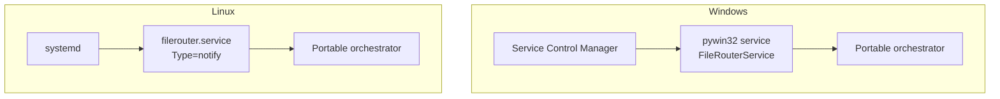

# 12 — Deployment

## 1. Target platforms

```text
Windows Server 2019+   (primary target, native pywin32 service)
Linux (systemd)        (multi-platform parity)
Python 3.12+
```

The **Windows Task Scheduler is not used**: FileRouter runs as a **service** (a
long-running daemon with its own scan loop).

## 2. Execution model

A single portable daemon (the orchestrator loop, [01](01-architecture.md)) is
wrapped by an OS-specific wrapper. The wrappers contain **no business
logic**.



## 3. Windows — native service (pywin32)

- Service class via `win32serviceutil.ServiceFramework`; `SvcDoRun` starts the loop,
  `SvcStop` sets the cooperative shutdown flag (clean stop: finishes the current item,
  releases the locks, flushes the logs).
- Installation:
  ```bat
  python -m filerouter.service.windows install
  python -m filerouter.service.windows start
  ```
- **Service account**: managed account (gMSA) recommended, non-administrator, *Log on as a
  service*. Restricted ACLs on `runtime/`, `keys/`, `logs/` ([10](10-security-policy.md)).
- **Recovery**: configure automatic service restart (SCM recovery) in
  addition to the application-level recovery.
- **GnuPG**: Gpg4win installed; `gnupg_home` dedicated to the service account.

## 4. Linux — systemd

`filerouter.service` unit (excerpt):
```ini
[Unit]
Description=FileRouter
After=network.target local-fs.target

[Service]
Type=notify
User=filerouter
ExecStart=/opt/filerouter/venv/bin/python -m filerouter.service.linux
Restart=on-failure
RestartSec=5
# Hardening
NoNewPrivileges=true
ProtectSystem=strict
ProtectHome=true
PrivateTmp=true
ReadWritePaths=/var/lib/filerouter /var/log/filerouter
AmbientCapabilities=

[Install]
WantedBy=multi-user.target
```
- `Type=notify`: the daemon signals `READY=1` after the self-test (config + crypto) and sends a
  periodic `WATCHDOG` (systemd supervision).
- `Restart=on-failure` complements the application-level recovery.

## 5. Packaging & dependencies

- Distribution: `filerouter` wheel + dedicated venv (no global system install).
- Runtime dependencies: `PyYAML`, `jsonschema`, `python-gnupg` (or `PGPy`), `pywin32`
  (Windows only), `python-ulid`. **Pinned** versions (`requirements.lock`).
- The gpg binary (GnuPG/Gpg4win) is a documented **system prerequisite** when
  `backend: gnupg`.

## 6. Installation tree

```text
/opt/filerouter (Linux)  |  C:\Program Files\FileRouter (Windows)
├── venv/                 # interpreter + dependencies
├── filerouter/           # the package
config:
├── /etc/filerouter/config.yaml   |  C:\ProgramData\FileRouter\config.yaml
state:
├── /var/lib/filerouter/runtime/  |  D:\FileRouter\runtime\
├── /var/lib/filerouter/keys/     |  D:\FileRouter\keys\
└── /var/log/filerouter/          |  D:\FileRouter\logs\
```

> `runtime/` and the exchange directories must share the **same volume** (atomic
> publication). Document the placement of the `base_folders` (possibly distinct volumes →
> handled cross-volume path, [03 §4.2](03-state-management.md)).

## 7. Deployment procedure (summary)

1. Provision the service account and the ACLs/permissions.
2. Install Python 3.12+, the venv and the package; install GnuPG if `backend: gnupg`.
3. Deploy the (validated) YAML config, import the keys into `gnupg_home`.
4. Create the `runtime/` tree (the subdirectories are auto-created at boot if absent).
5. Install and start the service; verify the **self-test** (config + crypto) and the
   health check ([08](08-observability.md)).
6. Wire up the monitoring (metrics, alerts).

Upgrade strategy: [15 — Versioning & upgrade](15-versioning-upgrade.md).
