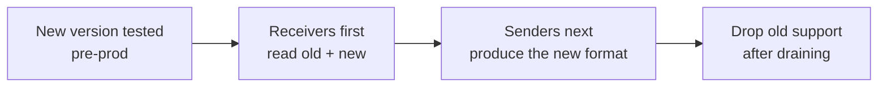

# 15 — Versioning & upgrade

## 1. Versioning scheme

- **Application**: SemVer `MAJOR.MINOR.PATCH`.
  - MAJOR: compatibility break (config, metadata/audit format, exchange protocol).
  - MINOR: backward-compatible feature.
  - PATCH: backward-compatible fix.
- **Data schemas**: independent `schema_version` in the metadata (and the audit), versioned
  separately from the application. The binary announces the schema versions it can read/write.

## 2. Artifact compatibility

| Artifact | Compatibility rule |
|----------|------------------------|
| **metadata** | The receiver must read any `schema_version` ≤ its own; unknown fields are ignored (forward tolerance). |
| **audit** | Append-only; never a destructive migration; new events additive. |
| **config** | Validated by schema; new fields with defaults; removed fields tolerated for one version (warning) before removal. |
| **technical name** | The pattern is carried in the metadata (`naming`) → a receiver rebuilds without depending on the sender's pattern. |

> Key principle: the **sender and the receiver can be at different versions**. Only
> the `alias` and the metadata (self-describing) circulate; the receiver does not need to
> know the sender's config.

## 3. Deployment strategy

- **Receivers before senders**: the hosts that *read* are upgraded first (forward
  tolerance), then those that *write*. Avoids an old receiver receiving a format it
  cannot read.
- **Rolling upgrade**: since the instances are independent (local FS state), they update
  one by one without central coordination.
- **Clean stop** before upgrade ([13](13-operations-guide.md)); the reconciliation on
  restart resumes the in-progress processing.

## 4. Schema migration (no database)

- Existing artifacts (audit, archive) are **not** migrated in bulk — they remain
  readable via forward tolerance.
- If a migration is needed (rare), a `filerouter migrate --from X --to Y` tool
  transforms the files in an **idempotent and interruptible** way (write-then-rename),
  audited in the admin stream.
- No global lock: the migration operates file by file.

## 5. Upgrade procedure

1. Read the release notes (breaks, migrations).
2. Validate the config on the new version: `filerouter validate-config`.
3. Deploy in pre-production, run the test suite ([18](18-testing-strategy.md)) and an
   end-to-end sender↔receiver test.
4. Upgrade the **receivers**, check health/trace.
5. Upgrade the **senders**.
6. Monitor backlog/quarantine/integrity after the switch-over.
7. Keep the previous version for a fast rollback.

## 6. Rollback

- Since the FS state is backward-compatible within the same MAJOR, a rollback is done by
  reinstalling the earlier version and restarting (reconciliation resumes).
- Between MAJOR versions (incompatible format), the rollback requires not having yet
  produced new-format artifacts on old receivers → hence the order
  "receivers before senders".

## 7. Software supply chain & CI

- **Pinned** dependencies (`requirements.lock`), generated SBOM, vulnerability scan at each
  build ([10 §7](10-security-policy.md)).
- Mandatory **regression** tests on the metadata/audit/config compatibility between
  versions ([18](18-testing-strategy.md)).
