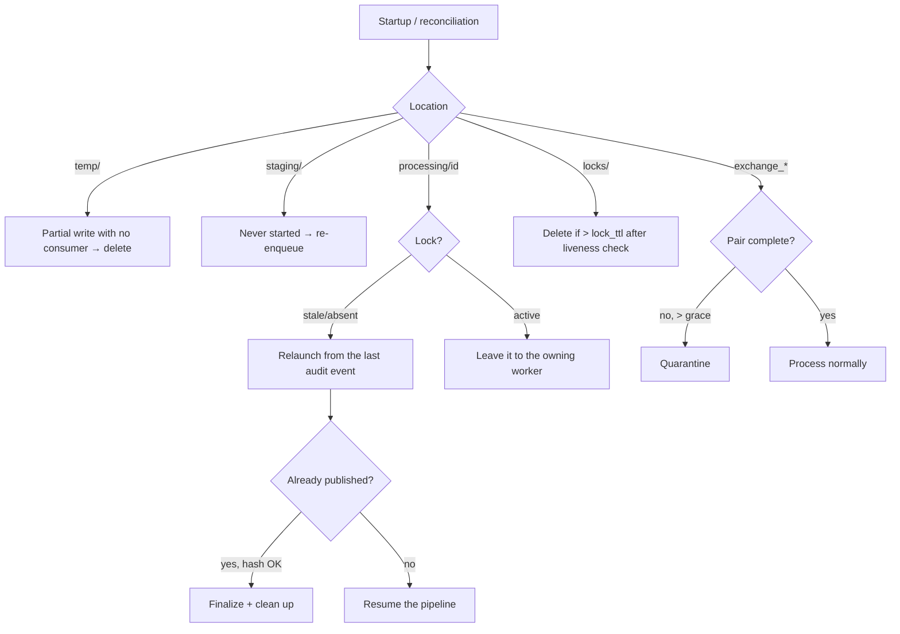

# 16 — Disaster recovery

The application must survive Windows reboots, Python crashes, network outages,
abrupt stops, incomplete files and interrupted processing — **without loss nor
double publication**. Recovery relies entirely on the filesystem state and idempotence
(see [03 — State management](03-state-management.md)).

## 1. Recovery invariants

1. Every transition is an **atomic rename** → any crash leaves the system in a known
   finite state.
2. Every visible artifact is published via **temp-then-rename** → never a visible partial
   file.
3. Every step is **idempotent** → relaunching does not duplicate the effect.
4. The **audit** records the last state reached → recovery knows where to resume.
5. At the slightest doubt → **quarantine**, never a deletion.

## 2. Startup reconciliation

Run systematically at boot (and periodically), it classifies each residual artifact:

## 3. Orphan file detection

| Orphan | Detection | Action |
|----------|-----------|--------|
| `temp/` partial | presence in `temp/`, age > `temp_orphan_max_age` | deletion |
| cross-volume `*.partial` | `.partial` suffix | deletion |
| `processing/` without lock | directory present, no active lock | idempotent relaunch |
| Incomplete pair (exchange) | payload without meta or vice versa, > grace | quarantine |
| Item in `staging/` | present, never processed | re-enqueue |
| Abandoned lock | `heartbeat_at` > `lock_ttl` | reaper takes it over |

## 4. Resumption of interrupted processing

- The pipeline resumes **from the last audit event**: e.g. if `ENCRYPTED` is
  present but not `MOVED_TO_EXCHANGE_OUT`, it resumes at the payload-hash/metadata computation without
  redoing the encryption if the payload already exists and its hash matches.
- If the final publication has already happened (file present at the destination + matching hash) but
  the finalization (source archive/deletion) was interrupted, it only **finalizes**.
- The costly steps (hash, encryption) are **reused** if their output is present and
  valid, otherwise **recomputed** (idempotence guaranteed).

## 5. Handling blocked files

- **Stale lock**: taken over by the reaper after `lock_ttl` + a liveness check of the
  owner (PID/host).
- **File being written by a third party**: not detected as long as the stable-size
  check is not satisfied ([03 §7](03-state-management.md)).
- **Unrecoverable item** (repeated deterministic error): quarantine after the
  retries are exhausted; never an infinite loop (attempt counter in the audit).

## 6. Duplicate handling at recovery

If a `technical_id` already has a terminal success audit event, the reappearance is
a duplicate and follows the policy in [09 §5](09-error-handling.md) (`skip` by default). Recovery
therefore never republishes an already-delivered file.

## 7. Scenarios & expected behavior

| Scenario | Behavior |
|----------|--------------|
| Windows reboot mid-processing | reconciliation resumes `processing/`; no file lost |
| Python crash | stale lock taken over; pipeline relaunched from the audit |
| Power outage during a rename | atomic rename: either the old or the new name exists, never in between |
| Outage during a cross-volume copy | only a `*.partial` remains → deleted |
| Network exchange cut (external transport) | out of scope; the files stay in the exchange, reprocessed when transport resumes |
| Incomplete file dropped | not detected (stability) or incomplete pair → quarantine after grace |
| Disk full mid-write | transient IO error → retry → quarantine; disk alert |

## 8. RTO / RPO

- **RPO ≈ 0**: no validated artifact is lost (atomicity + audit); at worst a processing
  is **replayed**, never lost.
- **RTO**: duration of the startup reconciliation (proportional to the number of residual
  items, generally small) + service restart. Reconciliation is
  parallelizable and interruptible.

## 9. Recovery plan (major disaster)

1. Restore the host/OS and the application venv.
2. Restore the config, `keys/` (offline encrypted backup) and `runtime/audit/`.
3. The volatile directories (`processing/`, `staging/`, `temp/`, `locks/`) do not need
   restoration — recreated/cleaned at boot.
4. Start the service; reconciliation resumes the items present in the exchange and the
   restored runtime.
5. Verify health, backlog, quarantine, integrity ([13](13-operations-guide.md)).
