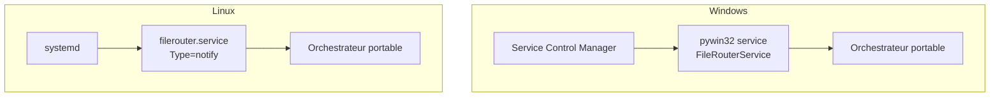

# 12 — Déploiement

## 1. Plateformes cibles

```text
Windows Server 2019+   (cible principale, service natif pywin32)
Linux (systemd)        (parité multi-plateforme)
Python 3.12+
```

Le **Planificateur de tâches Windows n'est pas utilisé** : FileRouter tourne en **service**
(daemon long-running avec sa propre boucle de scan).

## 2. Modèle d'exécution

Un unique daemon portable (la boucle de l'orchestrateur, [01](01-architecture.md)) est
encapsulé par une enveloppe spécifique à l'OS. Les enveloppes ne contiennent **aucune logique
métier**.



## 3. Windows — service natif (pywin32)

- Classe de service via `win32serviceutil.ServiceFramework` ; `SvcDoRun` lance la boucle,
  `SvcStop` positionne le drapeau d'arrêt coopératif (arrêt propre : termine l'item courant,
  libère les verrous, flush des logs).
- Installation :
  ```bat
  python -m filerouter.service.windows install
  python -m filerouter.service.windows start
  ```
- **Compte de service** : compte géré (gMSA) recommandé, non-administrateur, *Log on as a
  service*. ACL restreintes sur `runtime/`, `keys/`, `logs/` ([10](10-security-policy.md)).
- **Récupération** : configurer le redémarrage automatique du service (SCM recovery) en
  complément de la reprise applicative.
- **GnuPG** : Gpg4win installé ; `gnupg_home` dédié au compte de service.

### 3bis. Plusieurs instances sur une même machine

Plusieurs instances FileRouter peuvent tourner en **services natifs** sur le même hôte.
L'installeur accepte `--instance <nom>` : il crée un service au **nom unique**
`FileRouter_<nom>` et persiste le chemin de config dans la variable d'environnement
machine **`FILEROUTER_CONFIG_<NOM>`** (le service résout sa config depuis son propre nom).

```bat
python -m filerouter.service.windows install --instance siteA --config C:\SiteA\config.yaml
python -m filerouter.service.windows install --instance siteB --config C:\SiteB\config.yaml
python -m filerouter.service.windows start   --instance siteA
python -m filerouter.service.windows start   --instance siteB
```

Sans `--instance`, le nom par défaut reste `FileRouter` et la config est lue depuis
`FILEROUTER_CONFIG` (mode mono-instance, rétro-compatible).

> **Isolation obligatoire** : chaque instance doit avoir ses **propres** `runtime.root`,
> `exchange.out`/`exchange.in` et `logs` (et de préférence ses propres `base_folders`).
> Un exemple complet 2-sites prêt à l'emploi (configs + script de transport) est fourni
> dans [`docs/examples/two-instance/`](../examples/two-instance/README.md).

## 4. Linux — systemd

Unité `filerouter.service` (extrait) :
```ini
[Unit]
Description=FileRouter
After=network.target local-fs.target

[Service]
Type=notify
User=filerouter
ExecStart=/opt/filerouter/venv/bin/python -m filerouter.service.linux
Restart=on-failure
RestartSec=5
# Durcissement
NoNewPrivileges=true
ProtectSystem=strict
ProtectHome=true
PrivateTmp=true
ReadWritePaths=/var/lib/filerouter /var/log/filerouter
AmbientCapabilities=

[Install]
WantedBy=multi-user.target
```
- `Type=notify` : le daemon signale `READY=1` après self-test (config + crypto) et envoie un
  `WATCHDOG` périodique (supervision systemd).
- `Restart=on-failure` complète la reprise applicative.

## 5. Packaging & dépendances

- Distribution : wheel `filerouter` + venv dédié (pas d'install système globale).
- Dépendances runtime : `PyYAML`, `jsonschema`, `python-gnupg` (ou `PGPy`), `pywin32`
  (Windows uniquement), `python-ulid`. Versions **figées** (`requirements.lock`).
- Le binaire gpg (GnuPG/Gpg4win) est un **prérequis système** documenté quand
  `backend: gnupg`.

## 6. Arborescence d'installation

```text
/opt/filerouter (Linux)  |  C:\Program Files\FileRouter (Windows)
├── venv/                 # interpréteur + dépendances
├── filerouter/           # le package
config:
├── /etc/filerouter/config.yaml   |  C:\ProgramData\FileRouter\config.yaml
état:
├── /var/lib/filerouter/runtime/  |  D:\FileRouter\runtime\
├── /var/lib/filerouter/keys/     |  D:\FileRouter\keys\
└── /var/log/filerouter/          |  D:\FileRouter\logs\
```

> `runtime/` et les répertoires d'échange doivent partager le **même volume** (publication
> atomique). Documenter le placement des `base_folders` (volumes éventuellement distincts →
> chemin cross-volume géré, [03 §4.2](03-state-management.md)).

## 7. Procédure de déploiement (résumé)

1. Provisionner le compte de service et les ACL/permissions.
2. Installer Python 3.12+, le venv et le package ; installer GnuPG si `backend: gnupg`.
3. Déployer la config YAML (validée), importer les clés dans `gnupg_home`.
4. Créer l'arborescence `runtime/` (les sous-répertoires sont auto-créés au boot si absents).
5. Installer et démarrer le service ; vérifier le **self-test** (config + crypto) et le
   health check ([08](08-observability.md)).
6. Brancher la supervision (métriques, alertes).

Stratégie de montée de version : [15 — Versionnement & upgrade](15-versioning-upgrade.md).
